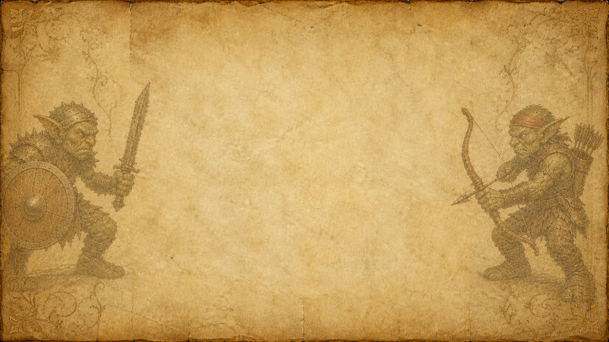
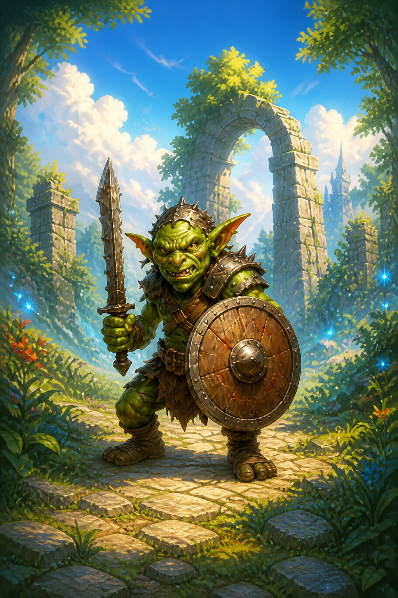
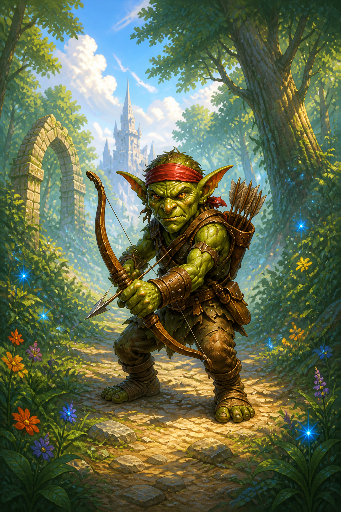

# 主菜单美术模块文档

## 1. 模块范围

本模块记录《99升变》主菜单的全屏背景、其中的羊皮纸表面和两侧哥布林壁画。标题与“开始游戏”为界面文字，不烘焙到背景图中；按钮复用项目已有红金交互 Sprite。

## 2. 模块风格

主体为暖棕、象牙色和旧金色的做旧羊皮纸，包含纸张纤维、折痕、磨损边缘与低对比角花。中央约六成宽度保持干净留白。左侧持剑盾哥布林朝右，右侧弓箭哥布林朝左；两者使用后中世纪木板蛋彩画式的平面轮廓、矿物颜料、细小龟裂和颜料脱落，以褪色半透明壁画的层级退居于界面内容。

## 3. UI 资产风格

| UI 资产或资产组 | UI 风格分组 ID | 分组名称 | 适用界面或区域 |
| --- | --- | --- | --- |
| 主菜单羊皮纸背景与红金按钮 | `UI-STYLE-001` | 明亮红蓝金奇幻卡牌界面 | 《99升变》主菜单 |

## 4. 图标规格

当前无独立图标资产。

## 5. 人物规格

当前无可拆分的人物图片；两名哥布林是封面背景的固定壁画内容。

## 6. 场景规格

当前无可拆分的场景图片；羊皮纸表面与边缘装饰与封面合成为同一资产。

## 7. 物件规格

当前无独立物件资产。

## 8. 参考图片

| 参考图片 | 来源或项目内路径 | 参考特征 | 适用范围 |
| --- | --- | --- | --- |
|  | `Assets/Resources/Art/MainMenu/UI/MainMenuCover.png` | 做旧羊皮纸、中央留白、两侧相向板绘哥布林 | 主菜单全屏背景 |
|  | `Assets/Resources/Art/BattleCards/GoblinWarrior.png` | 护甲、剑盾和哥布林体态 | 左侧壁画造型参考 |
|  | `Assets/Resources/Art/BattleCards/GoblinArcher.png` | 弓箭、头带和哥布林体态 | 右侧壁画造型参考 |

## 9. 目前已有资产列表

| 资产名称 | 项目内路径 | 图片内容与用途 | 尺寸 / 比例 | 文件格式 |
| --- | --- | --- | --- | --- |
| `MainMenuCover.png` | `Assets/Resources/Art/MainMenu/UI/MainMenuCover.png` | 主菜单羊皮纸全屏背景 | `1672 × 941 px` / 约 `16:9` | PNG |
| `PreparationContinueButtonIdle.png` | `Assets/Resources/Art/Preparation/UI/PreparationContinueButtonIdle.png` | 开始按钮常态 | 横向宽按钮 | PNG |
| `PreparationContinueButtonHighlighted.png` | `Assets/Resources/Art/Preparation/UI/PreparationContinueButtonHighlighted.png` | 开始按钮悬停与选中态 | 横向宽按钮 | PNG |
| `PreparationContinueButtonPressed.png` | `Assets/Resources/Art/Preparation/UI/PreparationContinueButtonPressed.png` | 开始按钮按下态 | 横向宽按钮 | PNG |
| `PreparationContinueButtonWaiting.png` | `Assets/Resources/Art/Preparation/UI/PreparationContinueButtonWaiting.png` | 开始按钮禁用态 | 横向宽按钮 | PNG |
