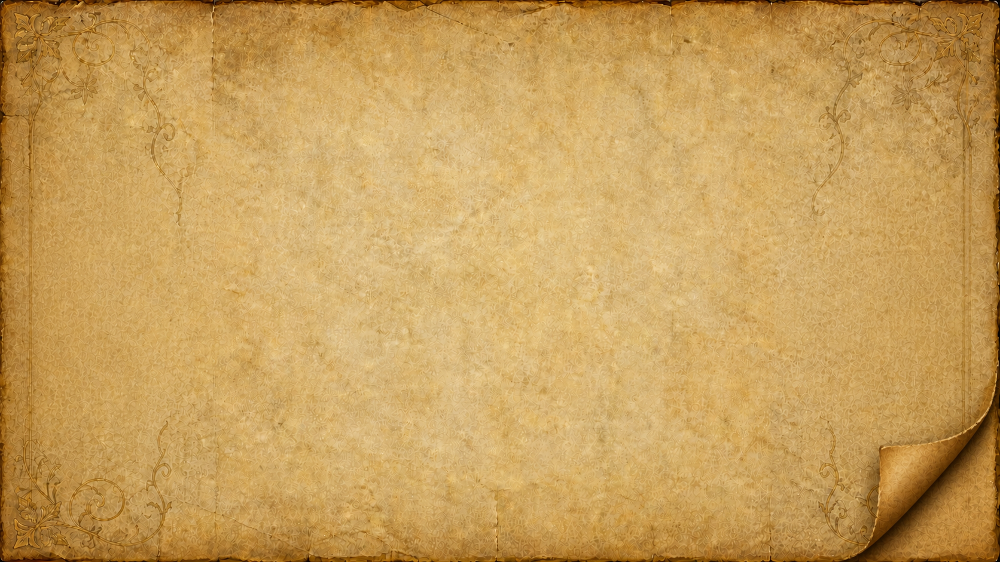
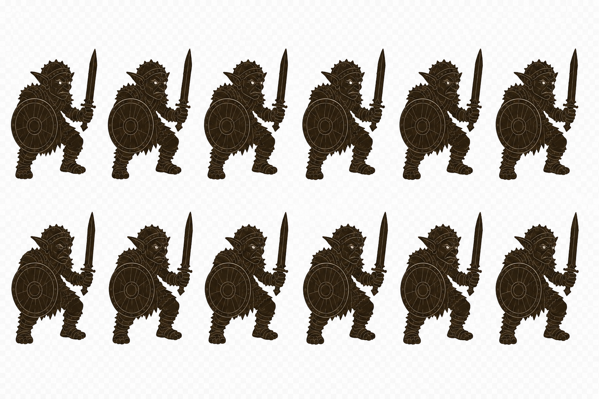
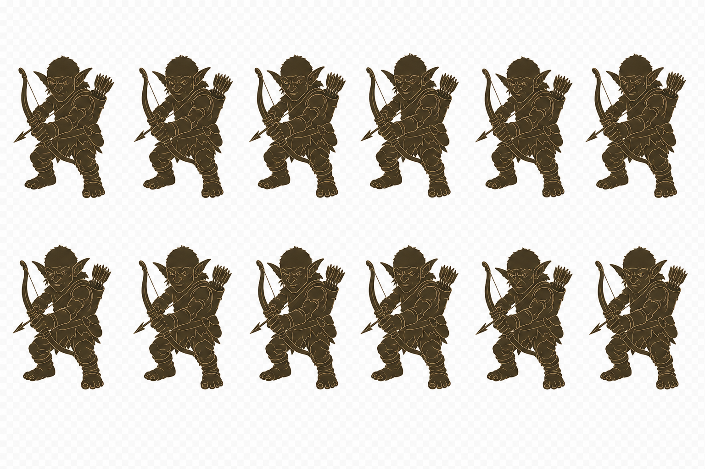
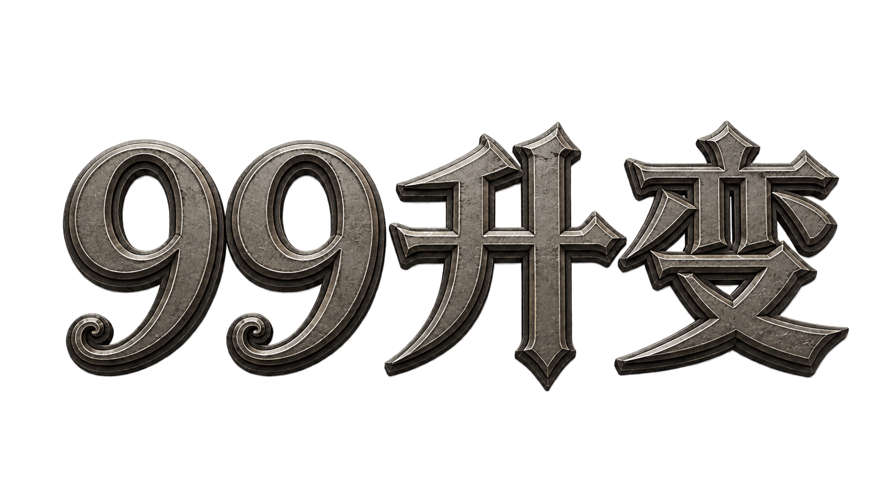
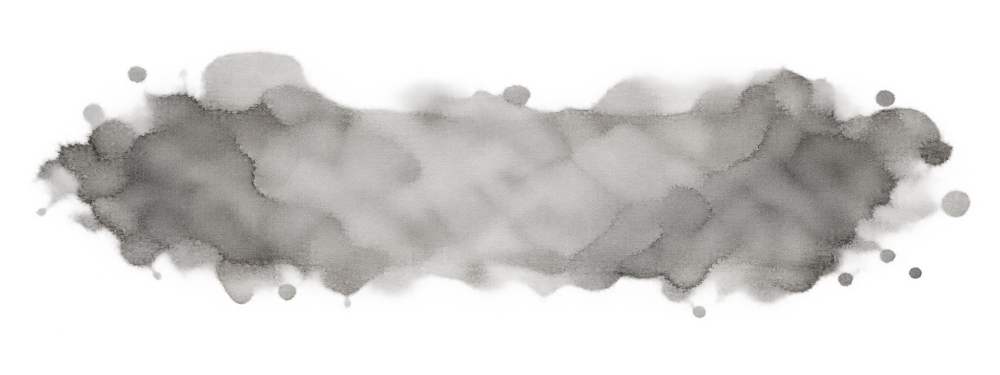

# 主菜单美术模块文档

## 1. 模块范围

本模块记录《99升变》主菜单的无人物全屏羊皮纸背景、左右两套独立哥布林剪影动作图集、独立绘制标题，以及“开始游戏”“图鉴”“退出游戏”共用的悬停水渍。标题是透明背景图片；三个中央入口本体均为界面文字，常态不显示底板。右上角临时“清除数据”使用红色文字和透明点击区，不增加图片底框；左下角版本号使用黑色小字，不增加独立图片资产。

## 2. 模块风格

主体为暖棕、象牙色和旧金色的做旧羊皮纸，包含纸张纤维、折痕、磨损边缘与低对比角花；右下纸角向内上翻，露出较深的暖棕背面并留下柔和接触阴影。背景本身不再包含人物，中央约六成宽度保持干净留白。左侧持剑盾哥布林朝右，右侧弓箭哥布林朝左；两者使用近乎实心的深棕剪影、清晰外轮廓和少量浅棕内在线条，仅保留面部、武器、护甲关节与肢体辨识信息。每套图集包含 `6 × 2` 排列的 12 个等尺寸全身动作格，显示时统一脚底基线与站立中心并保持人物比例稳定，仅表现轻微呼吸、重心与武器摆动。独立标题使用平均饱和度约 `0.19` 的旧黄铜灰、烟褐和暗木浮雕，避免亮金；三个中央入口共用羊皮纸纤维扩散的透明湿痕纹理，“开始游戏”和“图鉴”以低饱和灰褐色显示，“退出游戏”通过红色界面着色形成警示性的浸湿效果。

## 3. UI 资产风格

| UI 资产或资产组 | UI 风格分组 ID | 分组名称 | 适用界面或区域 |
| --- | --- | --- | --- |
| 主菜单无人物羊皮纸背景、两套哥布林剪影动作图集、绘制标题与湿润悬停纹理 | `UI-STYLE-001` | 做旧羊皮纸奇幻卡牌界面 | 《99升变》主菜单背景、两侧轻微动态人物、标题、开始游戏、图鉴与退出游戏入口 |

## 4. 图标规格

当前无独立图标资产。

## 5. 人物规格

左侧剑盾哥布林与右侧弓箭哥布林分别使用独立的 12 帧动作图集。两者保持深棕剪影、少量浅棕轮廓线和稳定全身比例；图集中的人物轮廓存在跨越名义格线的情况，最终界面按每帧完整主体边界与安全区显示，不截断轮廓，也不混入相邻帧残片。逐帧显示继续对齐脚底基线与站立中心，动作只改变呼吸、头肩重心和武器细微位置，不包含行走或攻击。

## 6. 场景规格

当前无可拆分的场景图片；羊皮纸表面与边缘装饰与封面合成为同一资产。

## 7. 物件规格

当前无独立物件资产。

## 8. 参考图片

| 参考图片 | 来源或项目内路径 | 参考特征 | 适用范围 |
| --- | --- | --- | --- |
|  | `Assets/Resources/Art/MainMenu/UI/MainMenuParchmentBackground.png` | 无人物与武器的做旧羊皮纸、中央留白、低对比角花与右下卷边 | 主菜单全屏背景 |
|  | `Assets/Resources/Art/MainMenu/UI/MainMenuGoblinWarriorFrames.png` | 深棕剪影、浅棕少量线条、最终显示基线稳定与轻微呼吸动作 | 主菜单左侧人物 |
|  | `Assets/Resources/Art/MainMenu/UI/MainMenuGoblinArcherFrames.png` | 深棕剪影、浅棕少量线条、最终显示基线稳定与轻微武器摆动 | 主菜单右侧人物 |
|  | `Assets/Resources/Art/MainMenu/UI/MainMenuTitle.png` | 低饱和旧黄铜、烟褐、暗木浮雕与轻油画纹理 | 主菜单上方游戏名 |
|  | `Assets/Resources/Art/MainMenu/UI/MainMenuStartHoverWetParchment.png` | 湿痕、纤维扩散和透明软边；前两个入口以灰褐色显示，退出入口由界面着为红色 | 三个中央按钮的鼠标悬停与按下底纹 |
|  | `Assets/Resources/Art/BattleCards/GoblinWarrior.png` | 护甲、剑盾和哥布林体态 | 左侧壁画造型参考 |
|  | `Assets/Resources/Art/BattleCards/GoblinArcher.png` | 弓箭、头带和哥布林体态 | 右侧壁画造型参考 |

## 9. 目前已有资产列表

| 资产名称 | 项目内路径 | 图片内容与用途 | 尺寸 / 比例 | 文件格式 |
| --- | --- | --- | --- | --- |
| `MainMenuParchmentBackground.png` | `Assets/Resources/Art/MainMenu/UI/MainMenuParchmentBackground.png` | 当前主菜单使用的无人物羊皮纸全屏背景；右下纸角向内上翻并带柔和接触阴影 | `1672 × 941 px` / 约 `16:9` | PNG |
| `MainMenuGoblinWarriorFrames.png` | `Assets/Resources/Art/MainMenu/UI/MainMenuGoblinWarriorFrames.png` | 左侧剑盾哥布林的 12 帧剪影动作图集，按 `6 × 2` 名义网格排列；显示时依据完整主体边界逐帧切割 | `1536 × 1024 px` / `3:2` | PNG |
| `MainMenuGoblinArcherFrames.png` | `Assets/Resources/Art/MainMenu/UI/MainMenuGoblinArcherFrames.png` | 右侧弓箭哥布林的 12 帧剪影动作图集，按 `6 × 2` 名义网格排列；显示时依据完整主体边界逐帧切割 | `1536 × 1024 px` / `3:2` | PNG |
| `MainMenuCover.png` | `Assets/Resources/Art/MainMenu/UI/MainMenuCover.png` | 原一体式羊皮纸与哥布林封面，当前不再由主菜单 Prefab 引用，保留为美术参考 | `1672 × 941 px` / 约 `16:9` | PNG |
| `MainMenuTitle.png` | `Assets/Resources/Art/MainMenu/UI/MainMenuTitle.png` | 独立绘制的低饱和“99升变”透明标题 | `1672 × 941 px` / 约 `16:9` | PNG |
| `MainMenuStartHoverWetParchment.png` | `Assets/Resources/Art/MainMenu/UI/MainMenuStartHoverWetParchment.png` | 三个中央按钮悬停与按下时共用的湿润羊皮纸纹理；退出入口以红色界面着色 | `2048 × 768 px` / 约 `8:3` | PNG |
