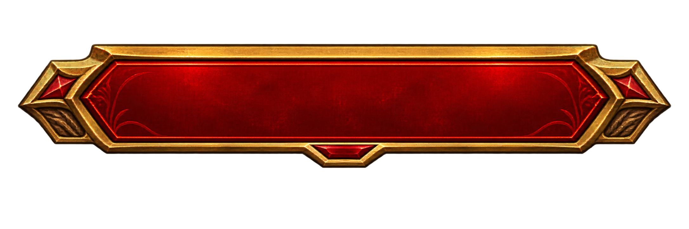
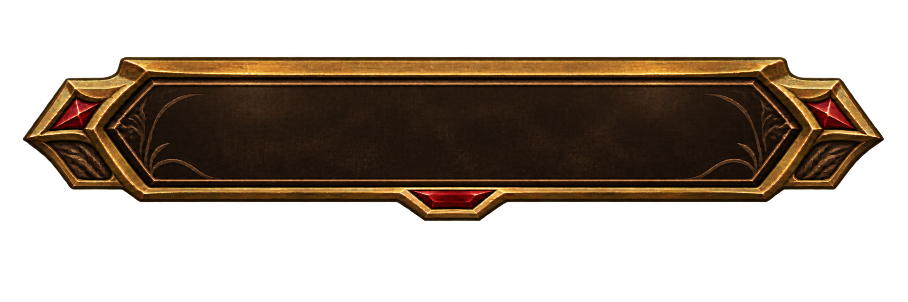
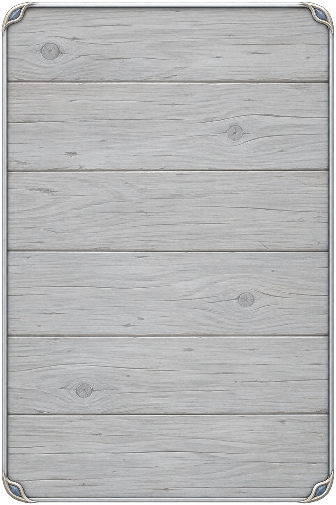
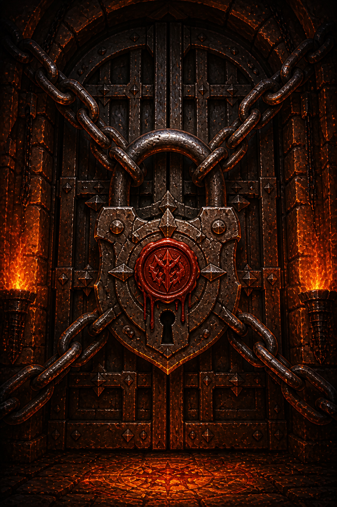

# 备战卡池美术模块文档

## 1. 模块范围

本模块覆盖备战页面背景、出战/融合切换页签、卡池面板、空槽、99 号封印锁位、滚动条、拖放反馈、融合面板与按钮、出战文字状态、融合结果揭晓层和 Continue Button。卡池、出战槽、融合槽与融合结果揭晓中的已持有卡都直接使用 `Assets/Resources/Ui/BattleCardItem.prefab` 的战斗卡面视觉，不再维护独立完整卡面；常规列表只保留空态、文字状态与投放反馈，并统一为 `25:36` 宽高比例。

## 2. 模块风格

备战上区羊皮纸以 `18%` 整体 Alpha 叠加与战斗棋盘相同的透明做旧层；零星淡斑、水渍边和短划痕打破平整底色，但主要卡牌区域保持低干扰。

备战界面沿用美术风格总文档的红、蓝、金奇幻卡牌语言。上区使用暖色羊皮纸，顶部阶段标题框以 `580 × 110` 的界面尺寸展示，`46 px` 的“备战阶段”按可见框心轻微上调 `2 px`。木质幕布左上角以成组切换页签组织出战与融合操作：选中态为高亮红金、未选态为低对比深木金边；两张 `330 × 100` 页签内使用 `31 px` 标签，并按素材可见框心统一上调 `4 px`。右上继续按钮使用 `40 px` 标签，按按钮可见框心上调 `3 px`。出战卡整体上提，并与下方深蓝卡池面板保留清晰留白，形成均衡的上下比例。深蓝卡池底板在 `1600 × 500` 的内部范围铺设两排对称稀疏纹样，由 6 个浅蓝空心菱形和 12 个小菱点组成；线纹 Alpha 为 `7.5%`、小点 Alpha 为 `5%`，保持低对比并退居卡牌内容之后。卡池左上角的“查看拥有”整行使用深海军蓝木纹窄横框、细暖金边与两端冷蓝宝石，横框左边缘与卡池面板左边缘贴齐；方形勾选底板位于横框内，勾选态在中心叠加浅金色对勾。两张底图外侧均为透明 Alpha，文字保持浅色 SemiBold。专属交互图形集中在页面框体、空态、按钮和状态文字。已持有卡使用共享卡框的运行时等阶着色：铜 `#B87333`、银 `#C0CCD8`、金 `#E7A93B`、传奇紫 `#B25CFF`；鼠标悬停时同一 Sprite 临时切换为黄色，移开后恢复对应等阶色。卡池中已放入出战槽的卡保留完整卡面，并在右上角以 `18 px` SemiBold、棕色 `#8B5226` 显示“已出战”，不另加底图。备战页与共享卡面中文采用 `Noto Sans SC SemiBold`，直接以较粗字面保证羊皮纸和深色卡面上的可读性。

融合揭晓层使用 `78%` Alpha 的中性深灰全屏遮罩压低背景。中央封印面为深灰蓝卡底、暖金卡框与暖金菱形封印，中央以金色问号隐藏结果；卡背采用深海军蓝底、暖金外框与蓝金双层菱形，中心以高亮青蓝宝石建立魔法焦点。卡体以 `250 × 360` 为正常展示尺寸，入场先从 `0.72` 倍放大到 `1.28` 倍形成视觉峰值，再在旋转至结果正面前平滑回落到 `1` 倍，避免揭晓后持续遮挡背景。结果正面复用共享等阶卡面，卡面上方的闪光为略带冷蓝的白色窄带，以约 `18°` 斜角从左向右扫过，并裁切在卡面范围内。封印、卡背、遮罩和闪光均由页面 Prefab 的基础 UI 图形组合，不新增独立位图资产。

卡池中的 99 号固定分隔位使用 `FusionCard_099.png`：深色锻铁巨门居中承载盾形巨锁，四向粗链和暗红封印强化不可获得语义，周围只保留克制的橙红炉火轮廓。它在普通未持有空槽和 100 号以后的融合卡位之间保持完整原画，不显示攻血徽章，也不使用普通蓝色持有态。

## 3. UI 资产风格

| UI 资产或资产组 | UI 风格分组 ID | 分组名称 | 适用界面或区域 |
| --- | --- | --- | --- |
| 备战页面与交互 Sprite | `UI-STYLE-001` | 明亮红蓝金奇幻卡牌界面 | 备战页面背景、页签、卡池、槽位、融合和继续区域 |
| 查看拥有勾选框 | `UI-STYLE-001` | 明亮红蓝金奇幻卡牌界面 | 卡池左上角的筛选开关底板与浅金色勾选反馈 |
| 卡池浅色几何底纹 | `UI-STYLE-001` | 明亮红蓝金奇幻卡牌界面 | 深蓝卡池底板内、滚动卡牌内容之后的低透明度装饰 |
| 共享等阶卡面与状态文字 | `UI-STYLE-001` | 明亮红蓝金奇幻卡牌界面 | 卡池、出战槽和融合槽中的已持有卡；复用可着色卡框、编号框、攻击/生命徽章和卡牌原画，卡池右上角可显示棕色“已出战” |
| 共享羊皮纸做旧层 | `UI-STYLE-001` | 明亮红蓝金奇幻卡牌界面 | 备战上区羊皮纸表面；与战斗棋盘复用同一 Sprite |
| 融合结果揭晓层 | `UI-STYLE-001` | 明亮红蓝金奇幻卡牌界面 | 融合成功后的灰色遮罩、封印面、蓝金卡背、共享结果卡面与斜向闪光 |

共享卡框使用中性银白 `CardFrame-v3.png`，由界面着色为铜、银、金、传奇四阶或悬停黄 `#FFD230`；不额外维护四阶和悬停图片。卡池未持有位置、融合页已选素材的原位置和未占用融合槽共同使用 `PreparationPoolEmptySlot.png`：画布为 `1024 × 1536`，内部是低对比浅灰木板与稀疏横向拼缝，外沿只保留在小卡位下约 `2~3 px` 可见宽度的冷银灰细边和克制的蓝灰角饰，轮廓外为真实透明 Alpha。该空槽是一张完整底图，不再让根节点浅灰纯色从边缘露出，也不复用较厚的战斗卡框。卡框下边缘相对 `250 × 360` 卡面底边上移 `24 px`，攻击与生命徽章保持在卡框前景层，使徽章下部从卡框外完整露出。等比缩放到三种备战尺寸时，该间距和层级随卡面一致缩放。

## 4. 图标规格

当前没有脱离 UI 控件独立使用的图标资产；滚动箭头和槽位高亮均作为 §3 UI 资产的一部分维护，旧素材角标当前不再显示。

## 5. 人物规格

## 6. 场景规格

## 7. 物件规格

## 8. 参考图片

| 参考图片 | 来源或项目内路径 | 参考特征 | 适用范围 |
| --- | --- | --- | --- |
|  | `Assets/Resources/Art/Preparation/UI/PreparationTabSelectedV2.png` | 红色漆面、金色厚边和中央下凸连接结构 | 当前选中的出战或融合页签 |
|  | `Assets/Resources/Art/Preparation/UI/PreparationTabIdleV2.png` | 深木内底、降低高光的金边，保持与选中态相同轮廓 | 未选中的相邻页签 |
|  | `Assets/Resources/Art/Preparation/UI/PreparationTabSelected.png` | 方形深蓝内凹面、细暖金边、透明外部安全区；界面叠加浅金色勾 | 卡池左上角“查看拥有”筛选开关 |
|  | `Assets/Resources/Art/Preparation/UI/PreparationTabIdle.png` | 深蓝木纹内底、细暖金边和两端冷蓝宝石；中央留空承载勾选框与 TMP 文字 | 卡池左上角“查看拥有”整行底框 |
|  | `Assets/Resources/Art/Preparation/UI/PreparationPoolEmptySlot.png` | 完整浅灰木板底、稀疏拼缝与极细冷银边；轮廓外透明 | 卡池未持有编号、融合素材原位置和未占用融合槽 |
|  | `Assets/Resources/Art/BattleCards/FusionCard_099.png` | 居中巨锁、交叉粗链、锻铁门和暗红封印；小卡位下仍明确表达不可获得 | 普通卡位与 100 号以后融合卡位之间的固定分隔 |

## 9. 目前已有资产列表

| 资产名称 | 项目内路径 | 图片内容与用途 | 尺寸 / 比例 | 文件格式 |
| --- | --- | --- | --- | --- |
| `PreparationPageBackground.png` | `Assets/Resources/Art/Preparation/UI/PreparationPageBackground.png` | 备战页全屏背景 | `1672 × 941` | PNG |
| `ParchmentAgingOverlay.png` | `Assets/Resources/Art/Preparation/UI/ParchmentAgingOverlay.png` | 战斗与备战共用的透明羊皮纸做旧层；只含低对比淡斑、水渍边和短划痕 | `1672 × 941` / 约 `16:9` | PNG |
| `PreparationStageTitleFrame.png` | `Assets/Resources/Art/Preparation/UI/PreparationStageTitleFrame.png` | 顶部阶段标题底框 | `2188 × 719` | PNG |
| `PreparationRewardPanel.png` | `Assets/Resources/Art/Preparation/UI/PreparationRewardPanel.png` | 旧奖励提示底框；当前备战页不再引用 | `2172 × 724` | PNG |
| `PreparationSectionLine.png` | `Assets/Resources/Art/Preparation/UI/PreparationSectionLine.png` | 出战槽标题分隔线 | `2172 × 724` | PNG |
| `PreparationBattleSlotFrame.png` | `Assets/Resources/Art/Preparation/UI/PreparationBattleSlotFrame.png` | 三个出战槽的空态框 | `1024 × 1536` / `2:3` | PNG |
| `PreparationCardPoolPanel.png` | `Assets/Resources/Art/Preparation/UI/PreparationCardPoolPanel.png` | 深蓝卡池外框 | `1881 × 836` | PNG |
| `PreparationPoolEmptySlot.png` | `Assets/Resources/Art/Preparation/UI/PreparationPoolEmptySlot.png` | 卡池未持有卡位、融合素材原位置和未占用融合槽共用的完整浅灰木纹底图；极细冷银边与蓝灰角饰，轮廓外透明 | `1024 × 1536` / `2:3` | PNG |
| `PreparationScrollTrack.png` | `Assets/Resources/Art/Preparation/UI/PreparationScrollTrack.png` | 纵向滚动轨道 | `1024 × 1536` | PNG |
| `PreparationScrollThumb.png` | `Assets/Resources/Art/Preparation/UI/PreparationScrollThumb.png` | 纵向滚动滑块 | `724 × 2172` | PNG |
| `PreparationScrollArrow.png` | `Assets/Resources/Art/Preparation/UI/PreparationScrollArrow.png` | 上下滚动方向装饰；下箭头旋转复用 | `1254 × 1254` | PNG |
| `PreparationDropHighlight.png` | `Assets/Resources/Art/Preparation/UI/PreparationDropHighlight.png` | 有效槽位悬停高亮，显示 Alpha 为 `0.72` | `1024 × 1536` / `2:3` | PNG |
| `PreparationTabIdle.png` | `Assets/Resources/Art/Preparation/UI/PreparationTabIdle.png` | “查看拥有”整行蓝金窄横框；沿用旧版无引用页签资源的文件名与 GUID，当前页签仍使用 V2 | `1536 × 270` / 约 `5.7:1` | PNG |
| `PreparationTabSelected.png` | `Assets/Resources/Art/Preparation/UI/PreparationTabSelected.png` | “查看拥有”勾选框底板；沿用旧版无引用页签资源的文件名与 GUID，当前页签仍使用 V2 | `1254 × 1254` / `1:1` | PNG |
| `PreparationTabIdleV2.png` | `Assets/Resources/Art/Preparation/UI/PreparationTabIdleV2.png` | 左上角切换页签未选态；深木内底与低对比金边 | `2172 × 724` / `3:1` | PNG |
| `PreparationTabSelectedV2.png` | `Assets/Resources/Art/Preparation/UI/PreparationTabSelectedV2.png` | 左上角切换页签选中态；红色漆面与高亮金边 | `2172 × 724` / `3:1` | PNG |
| `PreparationFusionSlotFrame.png` | `Assets/Resources/Art/Preparation/UI/PreparationFusionSlotFrame.png` | 旧融合素材槽空态框；当前共享卡 Prefab 不再引用 | `1024 × 1536` / `2:3` | PNG |
| `PreparationFusionSumPanel.png` | `Assets/Resources/Art/Preparation/UI/PreparationFusionSumPanel.png` | 素材表达式、公式命中结果与提示面板 | `2098 × 749` | PNG |
| `PreparationFusionButtonDisabled.png` | `Assets/Resources/Art/Preparation/UI/PreparationFusionButtonDisabled.png` | 融合按钮禁用态 | `2172 × 724` | PNG |
| `PreparationFusionButtonEnabled.png` | `Assets/Resources/Art/Preparation/UI/PreparationFusionButtonEnabled.png` | 融合按钮可用态 | `2172 × 724` | PNG |
| `PreparationFusionButtonPressed.png` | `Assets/Resources/Art/Preparation/UI/PreparationFusionButtonPressed.png` | 融合按钮按压态 | `2172 × 724` | PNG |
| `PreparationMaterialSelected.png` | `Assets/Resources/Art/Preparation/UI/PreparationMaterialSelected.png` | 旧融合素材选中角标；当前融合页改用浅灰空槽反馈，不再显示该图 | `1254 × 1254` | PNG |
| `FusionCard_099.png` | `Assets/Resources/Art/BattleCards/FusionCard_099.png` | 卡池 99 号固定封印分隔位；不显示普通未持有空态，不作为可拖拽卡牌 | `1024 × 1536` / `2:3` | PNG |
| `PreparationContinueButtonIdle.png` | `Assets/Resources/Art/Preparation/UI/PreparationContinueButtonIdle.png` | Continue Button 常态 | `1024 × 420` | PNG |
| `PreparationContinueButtonHighlighted.png` | `Assets/Resources/Art/Preparation/UI/PreparationContinueButtonHighlighted.png` | Continue Button 悬停态 | `1024 × 420` | PNG |
| `PreparationContinueButtonPressed.png` | `Assets/Resources/Art/Preparation/UI/PreparationContinueButtonPressed.png` | Continue Button 按压态 | `1024 × 420` | PNG |
| `PreparationContinueButtonWaiting.png` | `Assets/Resources/Art/Preparation/UI/PreparationContinueButtonWaiting.png` | Continue Button 等待态 | `1024 × 420` | PNG |

上述位图由对应 Builder 校验为 Single Sprite、Alpha Is Transparency、无 Mipmap、Clamp。卡面通用边框、编号六边形、攻血徽章和编号原画记录在 `AutoDoc/Art/UI/ui-art-overview.md` 与战斗卡牌模块文档中，本模块不重复列出。
