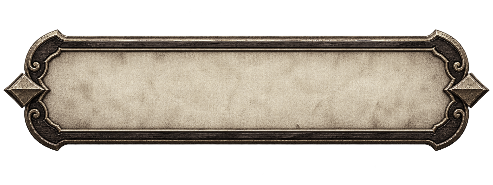
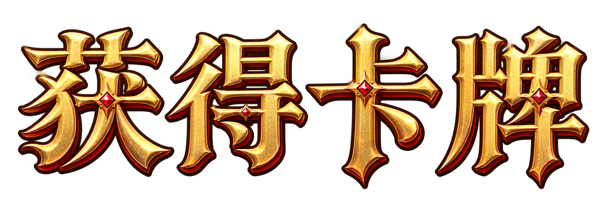
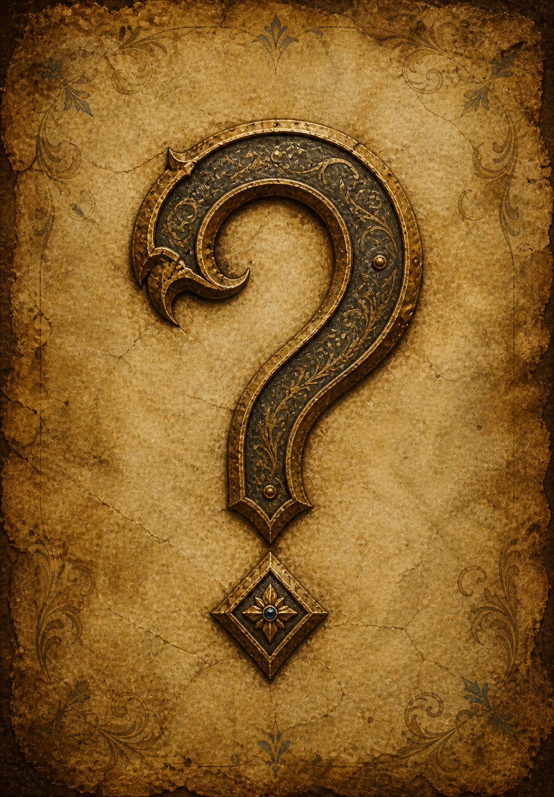
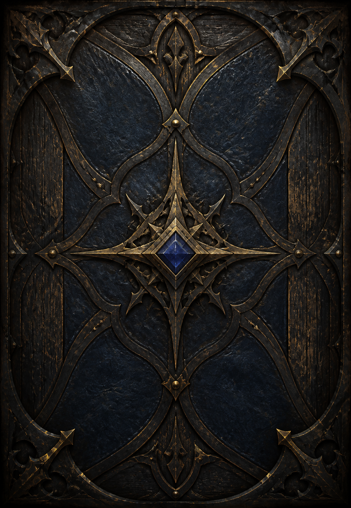
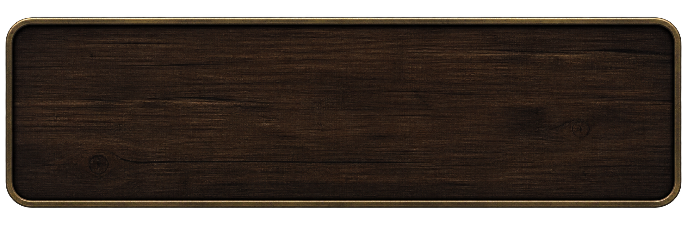
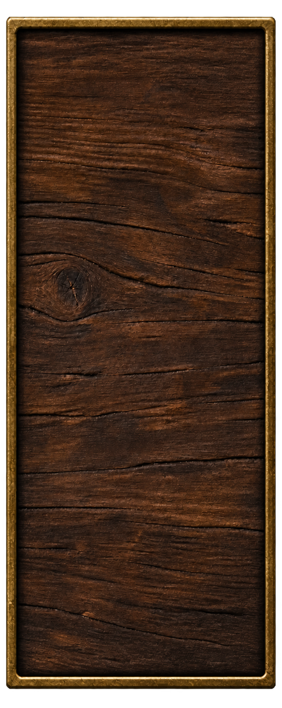
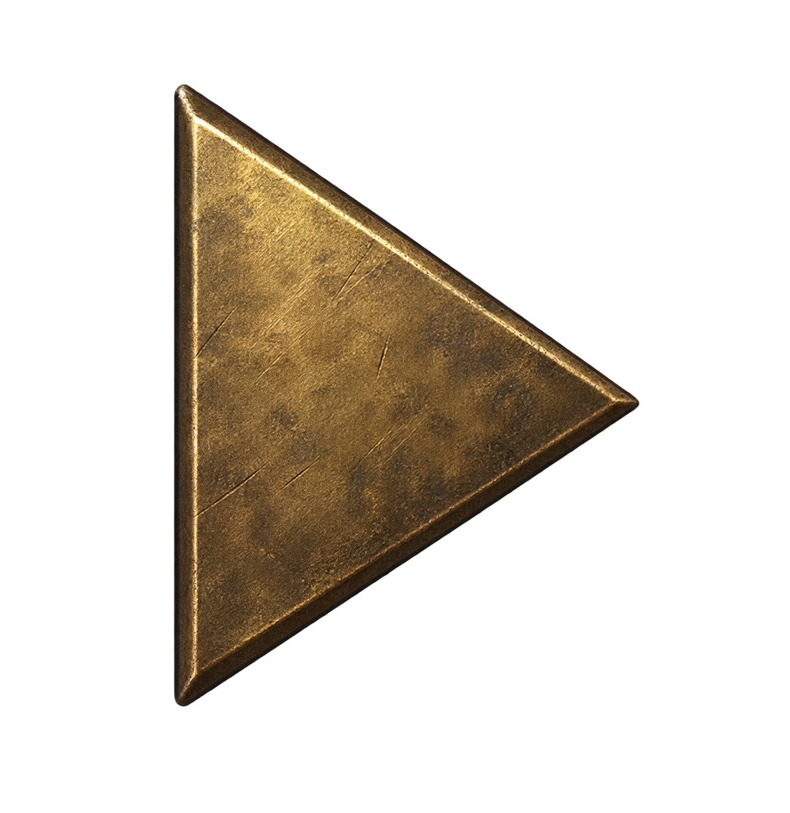

# 备战卡池美术模块文档

## 1. 模块范围

本模块覆盖备战页面背景、出战/融合切换页签、敌方阵容预览抽屉、卡池面板、空槽、99 号封印锁位、滚动条、拖放反馈、融合面板与按钮、智能推荐弹窗、出战文字状态、备战奖励展示层、融合结果揭晓层和 Continue Button。主菜单图鉴复用本模块的页面背景、卡池面板、99 号封印锁面和共享卡牌视觉。卡池、出战槽、敌方预览、融合槽、智能推荐组合、备战奖励、融合结果揭晓与图鉴中的已解锁卡都直接使用 `Assets/Resources/Ui/BattleCardItem.prefab` 的战斗卡面视觉，不再维护独立完整卡面；常规列表只保留空态、文字状态与投放反馈，并统一为 `25:36` 宽高比例。

## 2. 模块风格

备战上区羊皮纸以 `18%` 整体 Alpha 叠加与战斗棋盘相同的透明做旧层；零星淡斑、水渍边和短划痕打破平整底色，但主要卡牌区域保持低干扰。`PreparationPageBackground.png` 本体在上区羊皮纸左下绘入一处低对比杯底状水渍，右下角绘入向左上翻起的卷边；卷边使用完整暖金折面、较深背面与接触阴影直接替换原平面像素，不能在三角折角内露出原羊皮纸或切断相邻金属边框。

备战界面沿用美术风格总文档的做旧羊皮纸奇幻卡牌语言。上区使用暖色羊皮纸，顶部阶段标题框以 `580 × 110` 的界面尺寸展示，`46 px` 的“备战阶段”按可见框心轻微上调 `2 px`。标题框、两张 `330 × 100` 页签、右上继续按钮、融合与智能推荐按钮统一使用 `MedievalParchmentControl.png`：低饱和旧羊皮纸内面、深胡桃木雕边和暗古铜细边取代亮红漆面、宝石与高亮金边；悬停、按下、禁用和页签选中通过克制的明度与透明度着色表达。页签使用 `31 px` 深棕标签并上调 `4 px`，继续按钮使用 `40 px` 深棕标签并上调 `3 px`。出战区域不再放置“出战槽位”标题和两侧装饰线；二至六个槽位以 `185 px` 中心距排列，空槽与占用卡面都使用 `150 × 216 px` 轮廓，根缩放同为 `0.6 × 0.6`，相邻间距同为 `35 px`。融合素材槽以 `190 px` 中心距排列，空槽与占用卡面同样使用 `150 × 216 px` 轮廓和 `0.6 × 0.6` 根缩放，相邻间距为 `40 px`。两页空槽统一使用浅灰木纹空槽视觉；专用空槽把原始 `2:3` 图片完整映射到共享卡根的 `250 × 360` 轮廓，再与占用卡片共同使用对应页签的同一组 X/Y 缩放，因此宽高完全一致。空槽整体上提并与下方深蓝卡池面板保留清晰留白。深蓝卡池底板在 `1600 × 500` 的内部范围铺设两排对称稀疏纹样，由 6 个浅蓝空心菱形和 12 个小菱点组成；线纹 Alpha 为 `7.5%`、小点 Alpha 为 `5%`，保持低对比并退居卡牌内容之后。卡池左上角的“查看拥有”整行仍使用深海军蓝木纹窄横框、细暖金边与两端冷蓝宝石。已持有卡使用共享卡框的运行时等阶着色；鼠标悬停时同一 Sprite 临时切换为黄色，移开后恢复对应等阶色。备战页动态中文采用 `Noto Sans SC SemiBold`。

敌方预览采用从屏幕左侧拉出的深胡桃木抽屉。`PreparationEnemyPreviewPanel.png` 是约 `3:1` 的低饱和木制长板，只保留一层薄暗古铜外边和一层浅内线，不使用铆钉、宝石、卷草或厚重卡通描边；界面将其绘制为 `1500 × 400`，左栏使用 `38 px` 暖旧金色“敌方阵容”，右侧横排六个与我方出战区相同的 `150 × 216 px` 共享卡面，卡根缩放为 `0.6 × 0.6`。`PreparationEnemyPreviewToggle.png` 是较窄的四角矩形，界面显示尺寸为 `86 × 156`；木面保留明显板缝、结疤、粗糙纹理和暗部磨损，边缘使用单层做旧暗古铜细框，不采用新漆、高光或平整现代木纹。收起时其可见左边缘顶住屏幕左侧，按钮相对面板中心上移 `20 px`；展开后 Rect 向长板内重叠 `14 px`，覆盖两张图片的透明安全边并形成连续接缝。`PreparationEnemyPreviewArrow.png` 是独立的实心暗古铜右三角，只包含箭头头部，不包含矩形箭杆、底框或文字；其源图带透明安全区，界面 Rect 使用 `66 × 72` 以保证实际三角清晰可见，仅在抽屉到达展开或收起端点时切换方向。

融合素材区的标题与四个横排卡槽保持原有间距并整体上提 `30 px`，减少素材卡靠近下方卡池的拥挤感。融合面板右侧使用 `PreparationFusionSumPanel.png` 作为两个 `280 × 72` 的横向数值底板，并关闭等比保持：第一列第一排承载“当前点数”，第二排承载“剩余点数”，第三排放置 `216 × 68` 的智能推荐按钮；第二列第一排放置 `300 × 82` 的融合按钮。两个按钮与其他备战交互统一复用一张低饱和羊皮纸木框，通过 ColorTint 表现常态、悬停、按下与禁用。当前点数超过 `99` 时仅数字使用红色，精确等于 `99` 时仅数字在亮绿与白色之间循环提亮，并以不超过 `1.05` 倍的轻微缩放形成闪光感。

“智能推荐”和“融合”复用同一张低饱和羊皮纸木框，智能推荐位于第一列第三排，融合位于第二列第一排并承担更强的视觉权重。智能推荐按钮悬停时在右侧显示 `460 × 94` 的单行说明框，横向复用 `BattleBoardBackground.png`。推荐弹窗用 `78%` Alpha 的深蓝黑遮罩压低背景，中央 `1240 × 700` 面板直接复用同一战斗场景底板，并以 `14%` Alpha 叠加共享 `ParchmentAgingOverlay.png`。每个推荐项以低透明暖棕横条承载 2～4 张缩小的素材卡面；行右侧 `156 × 78` 的“选择”按钮也使用相同羊皮纸木框与状态着色。无结果时在羊皮纸中央显示“无可用组合”。

备战奖励展示层使用 `78%` Alpha 的中性深灰全屏遮罩，直接承载共享卡面，不在卡牌背后增加单独的灰色矩形底块。新获得卡牌从屏幕横坐标为 `0` 的底端以 `0.3` 倍尺寸依次滑入，在中央按 `280 px` 间距横向排开并放大到 `0.82` 倍。横排上方显示 `620 × 225` 界面尺寸的 `PreparationRewardTitle.png`：四个“获得卡牌”汉字以暖金浮雕字面、象牙高光、深红内阴影、暗棕外描边和少量红宝石节点构成，保持中世纪奇幻卡牌界面的轻油画质感；图像无底框、背景为透明 Alpha。全部到位后保留标准卡面悬停与词条说明。点击卡面外区域确认后，卡牌从左到右依次缩回 `0.3` 倍并滑向同一底端位置，形成收进口袋的视觉方向，不增加确认文字。

融合揭晓层使用 `78%` Alpha 的中性深灰全屏遮罩压低背景，但中央卡体不叠加局部灰色矩形蒙底或投影块。素材卡先以共享卡面铺成横向扇列，保持轻微高低差和角度差，再缩小收束至中心。未知正面使用 `FusionRevealQuestionFace.png`：满幅做旧羊皮纸以纤维、折痕、褪色纹章和暗边承载中央锻铁、暗金问号，整体为克制的中世纪轻油画质感；卡背使用 `FusionRevealCardBack.png`：深靛蓝黑皮革与旧木表面由暗金锻铁花饰加固，中央以小型蓝色珐琅宝石建立魔法焦点。两面都在外缘保留低细节安全区，并继续叠加共享 `CardFrame-v3` 暖金框。`250 × 360` 的卡体从极小尺寸放大到 `1.28` 倍、回落到 `0.82` 倍，再放大到至少 `2` 倍，使最终卡面高度不低于屏幕的三分之二。结果正面复用共享等阶卡面；四卡结果使用点数最高三张素材对应的三卡原画与名称，同时保留传奇紫卡框和四卡攻血、词条。揭晓闪光覆盖整个屏幕，Alpha 以正弦曲线升至全白并回落，在全白峰值切换结果卡面；结果停留阶段不增加“按任意键继续”等文字。卡面外点击确认后，结果卡快速缩向 `0.3` 倍并滑到屏幕横坐标为 `0` 的底端，卡片完全离开遮罩后才收起揭晓层。

卡池中的 99 号固定分隔位使用 `FusionCard_099.png`：深色锻铁巨门居中承载盾形巨锁，四向粗链和暗红封印强化不可获得语义，周围只保留克制的橙红炉火轮廓。它在普通未持有空槽和 100 号以后的融合卡位之间保持完整原画，不显示攻血徽章，也不使用普通蓝色持有态。

## 3. UI 资产风格

| UI 资产或资产组 | UI 风格分组 ID | 分组名称 | 适用界面或区域 |
| --- | --- | --- | --- |
| 备战页面与低饱和共用交互框 | `UI-STYLE-001` | 做旧羊皮纸奇幻卡牌界面 | 备战页面背景，以及阶段标题、页签、继续、融合、智能推荐和推荐项选择 |
| 查看拥有勾选框 | `UI-STYLE-001` | 做旧羊皮纸奇幻卡牌界面 | 卡池左上角的筛选开关底板与浅金色勾选反馈 |
| 卡池浅色几何底纹 | `UI-STYLE-001` | 做旧羊皮纸奇幻卡牌界面 | 深蓝卡池底板内、滚动卡牌内容之后的低透明度装饰 |
| 共享等阶卡面与状态图 | `UI-STYLE-001` | 做旧羊皮纸奇幻卡牌界面 | 卡池、出战槽和融合槽中的已持有卡；复用可着色卡框、编号框、攻击/生命徽章和卡牌原画，卡池右上角可显示黄色“已出战”旧木板图 |
| 共享羊皮纸做旧层 | `UI-STYLE-001` | 做旧羊皮纸奇幻卡牌界面 | 备战上区羊皮纸表面；与战斗棋盘复用同一 Sprite |
| 备战奖励展示层 | `UI-STYLE-001` | 做旧羊皮纸奇幻卡牌界面 | 每轮新卡的灰色全屏遮罩、金红“获得卡牌”透明艺术字、中央横排共享卡面与依次滑入/收纳动效 |
| 融合结果揭晓层 | `UI-STYLE-001` | 做旧羊皮纸奇幻卡牌界面 | 融合成功后的灰色遮罩、横向铺开的共享素材卡、封印面、蓝金卡背、放大的共享结果卡面与全屏白色闪光 |
| 智能融合推荐层 | `UI-STYLE-001` | 做旧羊皮纸奇幻卡牌界面 | 融合页内的深色模态遮罩、蓝金羊皮纸面板、横排共享卡面组合、素材已选标记、行右侧选择按钮、纵向滚动区与关闭按钮 |
| 敌方阵容预览抽屉 | `UI-STYLE-001` | 做旧羊皮纸奇幻卡牌界面 | 出战页左侧的窄矩形旧木侧签、纯三角方向箭头、木制长板和横排敌方共享卡面 |

共享卡框使用中性银白 `CardFrame-v3.png`，由界面着色为铜、银、金、传奇四阶或悬停黄 `#FFD230`；不额外维护四阶和悬停图片。卡池未持有位置、出战空槽、融合页已选素材的原位置和未占用融合槽共同使用 `PreparationPoolEmptySlot.png`：画布为 `1024 × 1536`，内部是低对比浅灰木板与稀疏横向拼缝，外沿只保留在小卡位下约 `2~3 px` 可见宽度的冷银灰细边和克制的蓝灰角饰，轮廓外为真实透明 Alpha。该空槽是一张完整底图，不再让根节点浅灰纯色或共享卡面的深色原画、说明底板从边缘露出，也不复用较厚的战斗卡框。卡框下边缘相对 `250 × 360` 卡面底边上移 `24 px`，攻击与生命徽章保持在卡框前景层，使徽章下部从卡框外完整露出。等比缩放到三种备战尺寸时，该间距和层级随卡面一致缩放。

## 4. 图标规格

| 图标或图标组 | 画布尺寸 | 主体占比与安全区 | 形状与线条 | 配色 | 背景 / Alpha | 视觉变体 |
| --- | ---: | --- | --- | --- | --- | --- |
| 敌方预览方向箭头 | `1237 × 1272 px` | 三角主体居中，四周保留透明安全区；界面 Rect 为 `66 × 72` | 仅一个朝右实心三角箭头头部；无矩形箭杆、无底框、无文字 | 做旧暗古铜，边缘带克制亮面 | 轮廓外真实透明 Alpha | 展开态由同一 Sprite 旋转 `180°`，不额外生成左箭头 |

## 5. 人物规格

## 6. 场景规格

## 7. 物件规格

## 8. 参考图片

| 参考图片 | 来源或项目内路径 | 参考特征 | 适用范围 |
| --- | --- | --- | --- |
|  | `Assets/Resources/Art/Common/UI/MedievalParchmentControl.png` | 旧羊皮纸、深胡桃木和暗古铜细边，无红漆、宝石或塑料高光 | 阶段标题、页签、继续、融合、智能推荐和选择按钮 |
|  | `Assets/Resources/Art/Preparation/UI/PreparationTabSelected.png` | 方形深蓝内凹面、细暖金边、透明外部安全区；界面叠加浅金色勾 | 卡池左上角“查看拥有”筛选开关 |
|  | `Assets/Resources/Art/Preparation/UI/PreparationTabIdle.png` | 深蓝木纹内底、细暖金边和两端冷蓝宝石；中央留空承载勾选框与 TMP 文字 | 卡池左上角“查看拥有”整行底框 |
|  | `Assets/Resources/Art/Preparation/UI/PreparationRewardTitle.png` | 暖金浮雕汉字、象牙高光、深红内阴影、暗棕描边和少量红宝石；透明无底框 | 备战奖励横排上方标题 |
|  | `Assets/Resources/Art/Preparation/UI/PreparationPoolEmptySlot.png` | 完整浅灰木板底、稀疏拼缝与极细冷银边；轮廓外透明 | 卡池未持有编号、出战空槽、融合素材原位置和未占用融合槽 |
|  | `Assets/Resources/Art/BattleCards/FusionCard_099.png` | 居中巨锁、交叉粗链、锻铁门和暗红封印；小卡位下仍明确表达不可获得 | 普通卡位与 100 号以后融合卡位之间的固定分隔 |
|  | `Assets/Resources/Art/Preparation/UI/FusionRevealQuestionFace.png` | 做旧羊皮纸、褪色纹章、暗金锻铁问号和轻油画材质 | 融合结果揭晓前的未知正面 |
|  | `Assets/Resources/Art/Preparation/UI/FusionRevealCardBack.png` | 深靛蓝皮革、旧木、暗金锻铁花饰与克制蓝宝石焦点 | 融合揭晓旋转过程中的卡背 |
|  | `Assets/Resources/Art/Preparation/UI/PreparationEnemyPreviewPanel.png` | 深胡桃木长板、单层薄暗古铜边、无额外装饰 | 敌方卡牌预览抽屉 |
|  | `Assets/Resources/Art/Preparation/UI/PreparationEnemyPreviewToggle.png` | 较窄四角矩形；旧木板缝与结疤、磨损暗古铜薄边、真实透明外部 | 贴屏并略微压入木板的抽屉侧签 |
|  | `Assets/Resources/Art/Preparation/UI/PreparationEnemyPreviewArrow.png` | 只有实心三角箭头头部，没有矩形箭杆 | 抽屉展开/收起方向提示 |

## 9. 目前已有资产列表

| 资产名称 | 项目内路径 | 图片内容与用途 | 尺寸 / 比例 | 文件格式 |
| --- | --- | --- | --- | --- |
| `PreparationPageBackground.png` | `Assets/Resources/Art/Preparation/UI/PreparationPageBackground.png` | 备战页全屏背景；上区羊皮纸左下含低对比杯底水渍，右下含不穿底的完整卷边与接触阴影 | `1672 × 941` | PNG |
| `BattleBoardBackground.png` | `Assets/Resources/Art/BattleCards/UI/BattleBoardBackground.png` | 战斗棋盘底板；备战智能推荐弹窗复用为木质金边羊皮纸面板，智能推荐悬浮说明框复用为暖棕木纹底板 | `1792 × 1008` / `16:9` | PNG |
| `ParchmentAgingOverlay.png` | `Assets/Resources/Art/Preparation/UI/ParchmentAgingOverlay.png` | 战斗与备战共用的透明羊皮纸做旧层；只含低对比淡斑、水渍边和短划痕 | `1672 × 941` / 约 `16:9` | PNG |
| `MedievalParchmentControl.png` | `Assets/Resources/Art/Common/UI/MedievalParchmentControl.png` | 当前共用低饱和羊皮纸交互框；阶段标题、页签、继续、融合、智能推荐和推荐项选择均引用 | `2048 × 768` / `8:3` | PNG |
| `PreparationStageTitleFrame.png` | `Assets/Resources/Art/Preparation/UI/PreparationStageTitleFrame.png` | 历史红金阶段标题底框；资源保留，当前 Prefab 不再引用 | `2188 × 719` | PNG |
| `PreparationRewardTitle.png` | `Assets/Resources/Art/Preparation/UI/PreparationRewardTitle.png` | 备战奖励展示层上方“获得卡牌”透明艺术字；金红中世纪轻油画字面 | `2079 × 756` / 约 `2.75:1` | PNG |
| `PreparationEnemyPreviewPanel.png` | `Assets/Resources/Art/Preparation/UI/PreparationEnemyPreviewPanel.png` | 敌方阵容预览的深胡桃木长板；薄暗古铜边，无铆钉、文字或装饰花边 | `2172 × 724` / `3:1` | PNG |
| `PreparationEnemyPreviewToggle.png` | `Assets/Resources/Art/Preparation/UI/PreparationEnemyPreviewToggle.png` | 贴住屏幕左侧并向木板内重叠的窄矩形侧签；延续上一版粗糙旧胡桃木、板缝结疤与磨损暗古铜薄边 | `650 × 1628` / 约 `0.40:1` | PNG |
| `PreparationEnemyPreviewArrow.png` | `Assets/Resources/Art/Preparation/UI/PreparationEnemyPreviewArrow.png` | 独立的暗古铜纯三角箭头头部；不含矩形箭杆、底框、文字或外投影 | `1237 × 1272` / 约 `1:1` | PNG |
| `PreparationRewardPanel.png` | `Assets/Resources/Art/Preparation/UI/PreparationRewardPanel.png` | 旧奖励提示底框；当前备战页不再引用 | `2172 × 724` | PNG |
| `PreparationSectionLine.png` | `Assets/Resources/Art/Preparation/UI/PreparationSectionLine.png` | 历史出战槽标题分隔线；资源保留，当前出战页不再引用 | `2172 × 724` | PNG |
| `PreparationBattleSlotFrame.png` | `Assets/Resources/Art/Preparation/UI/PreparationBattleSlotFrame.png` | 旧出战槽空态框；当前共享卡 Prefab 不再引用 | `1024 × 1536` / `2:3` | PNG |
| `PreparationCardPoolPanel.png` | `Assets/Resources/Art/Preparation/UI/PreparationCardPoolPanel.png` | 深蓝卡池外框 | `1881 × 836` | PNG |
| `PreparationPoolEmptySlot.png` | `Assets/Resources/Art/Preparation/UI/PreparationPoolEmptySlot.png` | 卡池未持有卡位、出战空槽、融合素材原位置和未占用融合槽共用的浅灰木纹底图 | `1024 × 1536` / `2:3` | PNG |
| `PreparationScrollTrack.png` | `Assets/Resources/Art/Preparation/UI/PreparationScrollTrack.png` | 纵向滚动轨道 | `1024 × 1536` | PNG |
| `PreparationScrollThumb.png` | `Assets/Resources/Art/Preparation/UI/PreparationScrollThumb.png` | 纵向滚动滑块 | `724 × 2172` | PNG |
| `PreparationScrollArrow.png` | `Assets/Resources/Art/Preparation/UI/PreparationScrollArrow.png` | 上下滚动方向装饰；下箭头旋转复用 | `1254 × 1254` | PNG |
| `PreparationDropHighlight.png` | `Assets/Resources/Art/Preparation/UI/PreparationDropHighlight.png` | 有效槽位悬停高亮，显示 Alpha 为 `0.72` | `1024 × 1536` / `2:3` | PNG |
| `PreparationDeployedText.png` | `Assets/Resources/Art/Preparation/UI/PreparationDeployedText.png` | 卡池已上阵卡右上角的黄色“已出战”旧木板状态图 | `2172 × 724` / `3:1` | PNG |
| `PreparationTabIdle.png` | `Assets/Resources/Art/Preparation/UI/PreparationTabIdle.png` | “查看拥有”整行蓝金窄横框；沿用旧版无引用页签资源的文件名与 GUID，当前页签仍使用 V2 | `1536 × 270` / 约 `5.7:1` | PNG |
| `PreparationTabSelected.png` | `Assets/Resources/Art/Preparation/UI/PreparationTabSelected.png` | “查看拥有”勾选框底板；沿用旧版无引用页签资源的文件名与 GUID，当前页签仍使用 V2 | `1254 × 1254` / `1:1` | PNG |
| `PreparationTabIdleV2.png` | `Assets/Resources/Art/Preparation/UI/PreparationTabIdleV2.png` | 历史切换页签未选态；资源保留，当前 Prefab 不再引用 | `2172 × 724` / `3:1` | PNG |
| `PreparationTabSelectedV2.png` | `Assets/Resources/Art/Preparation/UI/PreparationTabSelectedV2.png` | 历史红金切换页签选中态；资源保留，当前 Prefab 不再引用 | `2172 × 724` / `3:1` | PNG |
| `PreparationFusionSlotFrame.png` | `Assets/Resources/Art/Preparation/UI/PreparationFusionSlotFrame.png` | 旧融合素材槽空态框；当前共享卡 Prefab 不再引用 | `1024 × 1536` / `2:3` | PNG |
| `PreparationFusionSumPanel.png` | `Assets/Resources/Art/Preparation/UI/PreparationFusionSumPanel.png` | 融合页“当前点数”“剩余点数”共用的横向数值底板；实际显示为 `280 × 72` 并完整覆盖左右文本 | `2098 × 749` | PNG |
| `PreparationFusionButtonDisabled.png` | `Assets/Resources/Art/Preparation/UI/PreparationFusionButtonDisabled.png` | 历史融合按钮禁用态；资源保留，当前 Prefab 不再引用 | `2172 × 724` | PNG |
| `PreparationFusionButtonEnabled.png` | `Assets/Resources/Art/Preparation/UI/PreparationFusionButtonEnabled.png` | 历史融合按钮可用态；资源保留，当前 Prefab 不再引用 | `2172 × 724` | PNG |
| `PreparationFusionButtonPressed.png` | `Assets/Resources/Art/Preparation/UI/PreparationFusionButtonPressed.png` | 历史融合按钮按压态；资源保留，当前 Prefab 不再引用 | `2172 × 724` | PNG |
| `PreparationMaterialSelected.png` | `Assets/Resources/Art/Preparation/UI/PreparationMaterialSelected.png` | 旧融合素材选中角标；当前融合页改用浅灰空槽反馈，不再显示该图 | `1254 × 1254` | PNG |
| `FusionCard_099.png` | `Assets/Resources/Art/BattleCards/FusionCard_099.png` | 卡池 99 号固定封印分隔位；不显示普通未持有空态，不作为可拖拽卡牌 | `1024 × 1536` / `2:3` | PNG |
| `FusionRevealQuestionFace.png` | `Assets/Resources/Art/Preparation/UI/FusionRevealQuestionFace.png` | 融合揭晓未知正面；做旧羊皮纸承载暗金锻铁问号，无额外文字与卡外投影 | `1047 × 1503` / 约 `25:36` | PNG |
| `FusionRevealCardBack.png` | `Assets/Resources/Art/Preparation/UI/FusionRevealCardBack.png` | 融合揭晓卡背；深靛蓝皮革、旧木和暗金锻铁中世纪纹饰，无额外文字与卡外投影 | `1044 × 1507` / 约 `25:36` | PNG |
| `PreparationContinueButtonIdle.png` | `Assets/Resources/Art/Preparation/UI/PreparationContinueButtonIdle.png` | 历史 Continue Button 常态；资源保留，当前 Prefab 不再引用 | `1024 × 420` | PNG |
| `PreparationContinueButtonHighlighted.png` | `Assets/Resources/Art/Preparation/UI/PreparationContinueButtonHighlighted.png` | 历史 Continue Button 悬停态；资源保留，当前 Prefab 不再引用 | `1024 × 420` | PNG |
| `PreparationContinueButtonPressed.png` | `Assets/Resources/Art/Preparation/UI/PreparationContinueButtonPressed.png` | 保留的旧按压资产；当前 Continue Button 不引用 | `1024 × 420` | PNG |
| `PreparationContinueButtonWaiting.png` | `Assets/Resources/Art/Preparation/UI/PreparationContinueButtonWaiting.png` | 历史 Continue Button 等待态；资源保留，当前 Prefab 不再引用 | `1024 × 420` | PNG |

上述位图由对应 Builder 校验为 Single Sprite、Alpha Is Transparency、无 Mipmap、Clamp。卡面通用边框、编号六边形、攻血徽章和编号原画记录在 `AutoDoc/Art/UI/ui-art-overview.md` 与战斗卡牌模块文档中，本模块不重复列出。
