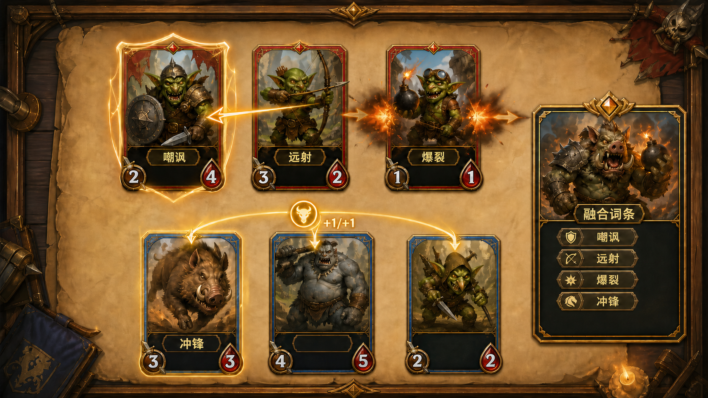

title: 怪物战斗词条与融合继承
state: Completed
priority: P1
plan: AutoDoc/DesignPlan/Plan/monster-combat-keywords-plan.md
review: AutoDoc/DesignPlan/Review/monster-combat-keywords-review.md

## 1. 需求简述

当前怪物主要依靠攻击力、生命值和原画形成差异，玩家难以仅凭卡牌理解各怪物在自动战斗中的独特定位。本策划为现有五类怪物加入一组可见、可组合的战斗词条，让玩家在查看卡牌时能够预判目标选择、伤害方式和团队成长，并让融合产物继承素材的战斗特色。

设计目标如下：

- 哥布林战士、哥布林弓箭手、哥布林投弹手和野猪分别拥有明确且唯一的初始词条；食人魔保持无词条的高基础属性定位。
- 词条名称显示在卡牌下部说明区，玩家无需等待词条触发即可辨认单位能力。
- 自动战斗中的目标选择、攻击伤害、反伤、范围伤害和团队增益拥有一致且可判定的规则。
- 卡牌融合后汇集全部素材词条，相同词条只保留一份，使融合产物能够形成可读的能力组合。

本策划不调整怪物基础攻血区间、战斗行动顺序、融合配方与基础属性公式，也不新增词条等级、词条叠层或新的怪物种类。现有自动战斗与卡面视觉背景可参考[战斗系统设计文档](../../Design/Specific/combat-system/combat-system.md)和[战斗卡牌美术模块文档](../../Art/Modules/battle-card/battle-card.md)。

## 2. 对应游戏场景

词条贯穿“查看卡牌—自动战斗—查看融合产物”三个连续场景：

1. 怪物卡牌进入战斗或融合结果生成后，卡牌说明区立即显示该单位当前拥有的词条。无论单位是否正在行动，词条列表都保持可见。
2. 三对三自动战斗中，系统依照原有行动顺序选择攻击者。选取目标时先处理嘲讽；攻击成立后依次处理冲锋、主目标伤害、爆裂伤害与可能发生的反伤。
3. 一次攻击的全部伤害与属性变化结算完成后，再更新死亡状态与胜负；死亡单位不再参与后续行动、目标选择或增益。
4. 卡牌融合完成时，产物的说明区展示从全部素材汇集并去重后的词条。玩家可在产物投入战斗前确认最终能力组合。

本次不新增玩家主动选取攻击目标的操作；嘲讽通过改变自动选取目标的候选范围影响战斗。词条的主要反馈来自说明区文字、目标选择结果、数值变化和受伤对象变化。

## 3. 玩法原型图

图示：单词条怪物在说明区显示词条名称，食人魔说明区不显示词条；战场上的高亮、箭线、爆炸与 `+1/+1` 表达四类触发结果，右侧融合产物只汇集并展示去重后的实际词条。图中数值和角色组合仅用于说明交互关系，不代表最终平衡配置。

## 4. 玩法详细设计

### 4.1 怪物与初始词条

| 怪物 | 初始词条 | 词条定位 | 卡牌说明区显示 |
| --- | --- | --- | --- |
| 哥布林战士 | 嘲讽 | 保护其他友方单位，改变敌人的攻击目标 | `嘲讽` |
| 哥布林弓箭手 | 远射 | 牺牲伤害换取不受反伤的安全攻击 | `远射` |
| 哥布林投弹手 | 爆裂 | 以主目标为中心波及相邻敌人 | `爆裂` |
| 野猪 | 冲锋 | 每次攻击前强化全体友方单位 | `冲锋` |
| 食人魔 | 无 | 保持纯基础属性定位，不触发或贡献任何词条 | 词条区域留空，不显示“无词条” |

初始词条与怪物种类绑定，不受卡牌编号或随机攻血结果影响。同一怪物的所有普通卡牌均使用相同初始词条。

### 4.2 卡牌说明区展示

- 怪物名称继续显示在说明区，词条名称作为名称下方的独立信息组显示，并与普通说明文字形成清晰层级。
- 单词条卡牌直接显示一个词条名称；融合产物拥有多个词条时，在说明区内逐项排列，不省略、不重复。
- 多词条固定按“嘲讽、远射、爆裂、冲锋”的顺序显示，与融合素材投入顺序无关，保证同一能力组合始终得到相同排版。
- 词条名称必须完整可读，不能因说明区空间不足而截断、重叠或缩小到难以辨认。
- 食人魔等无词条单位保留说明区的既有底板和怪物名称，但词条区域为空；“无词条”不是一个词条，也不能被融合产物继承。
- 词条只显示单位当前实际拥有的集合。融合去重后，说明区同步刷新为最终集合。

### 4.3 嘲讽

- 当一方单位准备攻击时，先检查敌方所有存活且可被攻击的单位。
- 若敌方至少有一个存活且可被攻击的嘲讽单位，本次攻击的目标候选范围只包含这些嘲讽单位；所有非嘲讽单位均不得被选中。
- 若候选范围中只有一个嘲讽单位，必定攻击该单位；若有多个嘲讽单位，则在全部候选嘲讽单位中随机选择一个。
- 嘲讽单位死亡或因其他规则暂时不可被攻击后，立即离开候选范围。敌方没有有效嘲讽单位时，恢复从全部存活且可被攻击单位中随机选取目标。
- 嘲讽只改变敌方对本单位阵营发起攻击时的目标候选范围，不改变攻击者、行动顺序、攻击伤害或友方目标。

### 4.4 远射

- 拥有远射的单位发起攻击时，本次主目标攻击伤害为该单位在本次伤害结算时攻击力的 `50%`，计算结果向下取整。
- 远射不设最低伤害保底。例如攻击力为 `5` 时造成 `2` 点主目标伤害，攻击力为 `1` 时造成 `0` 点伤害。
- 远射攻击不会受到本次受击目标返还的反伤。这里的反伤仅指由主目标在本次相互伤害结算中直接对攻击者造成的伤害。
- 远射不免除敌方单位之后主动攻击造成的伤害，也不免除爆裂等范围效果或其他非反伤来源的伤害。

### 4.5 爆裂

- 拥有爆裂的单位命中主目标时，除主目标伤害外，还会对主目标左右相邻一个卡位内的其他存活敌方单位造成爆裂伤害。
- 当前三卡位横向战场中，“周围一格”指与主目标槽位序号相差 `1` 的卡位。位于中间卡位的主目标最多波及左右两个单位；位于边缘卡位的主目标最多波及一个单位。
- 空卡位和死亡单位不会受到爆裂伤害，且不会让效果越过该卡位继续寻找更远单位。主目标不会重复受到爆裂伤害。
- 每个受波及单位受到的爆裂伤害等于本次主目标实际攻击伤害的 `50%`，结果向下取整，不设最低伤害保底。
- 爆裂伤害属于主攻击附带的范围伤害；受波及单位不会因此对攻击者造成反伤。
- 即使主目标被主目标伤害击至零生命，本次爆裂仍以其原卡位为中心完成结算。全部伤害完成后统一更新死亡状态。

### 4.6 冲锋

- 拥有冲锋的单位每次实际发起攻击时触发一次冲锋；仅轮到行动但未能发起攻击时不触发。
- 冲锋在本次攻击伤害计算前生效，使触发时仍存活的全部友方单位获得 `+1/+1`，包括攻击者自身。
- `+1/+1` 表示攻击力 `+1`、最大生命值 `+1`，并同时使当前生命值 `+1`；增加后的当前生命值不得超过增加后的最大生命值。
- 冲锋增益持续到本场战斗结束。同一单位之后再次实际发起攻击时可以再次触发，累计获得新的 `+1/+1`。
- 已死亡单位不获得增益；本次攻击后才进入战场的单位不追溯获得此前的冲锋增益。

### 4.7 单次攻击的词条结算顺序

为保证融合后多词条组合得到唯一结果，每次攻击按以下玩法顺序结算：

1. 确认本次攻击者仍然存活且能够攻击，攻击动作成立。
2. 若攻击者拥有冲锋，为当前全部存活友方单位结算一次 `+1/+1`。
3. 根据嘲讽规则形成目标候选范围，并从中选出主目标。
4. 以攻击者此时的攻击力计算主目标攻击伤害；拥有远射时先将该伤害减半并向下取整。
5. 拥有爆裂时，再以步骤 4 得到的主目标实际攻击伤害为基准计算各相邻单位的半额爆裂伤害并向下取整。因此远射与爆裂同时存在时，两次减半依次生效。
6. 主目标在本次攻击中返还反伤；攻击者拥有远射时不承受该反伤。相邻单位不返还反伤。
7. 本次攻击涉及的全部生命变化结算完成后，统一更新死亡状态与胜负结果。

### 4.8 融合词条继承

- 融合产物获得所有融合素材当前拥有词条的并集，而不是只继承某一个素材或某一种怪物的初始词条。
- 相同词条只保留一份，不叠加数量、倍率或触发次数。例如两个拥有冲锋的素材融合后，产物仍只有一个冲锋，每次攻击只触发一次冲锋效果。
- 无词条素材不向产物增加任何词条，也不会清除其他素材贡献的词条。
- 融合产物生成后立即按固定显示顺序刷新说明区。后续若该产物继续参与融合，以其去重后的当前词条集继续参与汇集。
- 融合只汇集词条，不改变各词条自身规则。产物同时拥有多个词条时，按照第 4.7 节的统一顺序共同生效。

### 4.9 边界与失败条件

- 攻击者在攻击动作成立前已经死亡、失去攻击资格，或敌方不存在可攻击单位时，本次攻击不成立，冲锋和其他攻击词条均不触发。
- 半额伤害每次在对应步骤独立向下取整，不保留小数供后续步骤使用。
- 伤害为 `0` 仍视为本次攻击已经发生；冲锋可以正常触发，嘲讽仍限制目标，爆裂可继续按规则计算为 `0`。
- 词条展示与实际效果必须来自同一单位的当前词条集合；不得出现说明区显示词条但战斗不生效，或战斗生效但说明区遗漏的状态。

## 5. 所需配置项

| 配置项 | 策划含义 | 建议值或范围 | 玩家可见影响 |
| --- | --- | --- | --- |
| 怪物初始词条 | 决定普通怪物卡牌进入游戏时拥有的词条 | 哥布林战士=嘲讽；哥布林弓箭手=远射；哥布林投弹手=爆裂；野猪=冲锋；食人魔=无 | 决定卡牌说明区内容与战斗定位 |
| 词条显示顺序 | 多词条在说明区内的稳定排列顺序 | 嘲讽→远射→爆裂→冲锋 | 相同组合始终使用相同排版，便于快速识别 |
| 远射伤害比例 | 远射攻击相对当前攻击力的主目标伤害比例 | `50%` | 降低单体伤害，换取免受反伤 |
| 远射取整规则 | 半额伤害出现小数时的处理方式 | 向下取整，最低可为 `0` | 奇数攻击力和低攻击力下结果可预期 |
| 爆裂影响距离 | 主目标周围可被波及的卡位距离 | `1` 个相邻卡位 | 决定范围攻击能覆盖的敌人数量 |
| 爆裂伤害比例 | 相邻单位相对本次主目标实际攻击伤害所受的比例 | `50%` | 控制范围伤害强度，并与远射组合形成连续减半 |
| 爆裂取整规则 | 爆裂半额伤害出现小数时的处理方式 | 向下取整，最低可为 `0` | 保证所有伤害均为整数 |
| 冲锋单次增益 | 每次攻击为存活友军增加的攻血数值 | `+1/+1` | 使队伍随野猪攻击次数逐步成长 |
| 冲锋持续时间 | 冲锋增益的保留时长 | 本场战斗 | 影响队伍成长节奏，不带出当前战斗 |
| 嘲讽多目标选择 | 多个有效嘲讽单位同时存在时的选取方式 | 在全部有效嘲讽单位中等概率随机 | 保留自动战斗的不确定性，同时确保非嘲讽单位受到保护 |
| 融合词条规则 | 融合素材词条的汇集方式 | 取并集并去重 | 让产物保留各素材的能力而不因重复素材额外叠层 |

## 6. 验收

### 6.1 验收方式

- **流程log验收**：覆盖 `FUNC-01` 至 `FUNC-10`。进入包含双方三卡位的自动战斗流程，并准备能够覆盖五类怪物、奇偶攻击力、多个嘲讽、边缘与中间主目标、重复词条融合和多词条融合的场景；按实际行动顺序运行战斗与融合操作。流程日志需能够逐次对应攻击者、候选目标与最终目标、攻击前后攻血、主目标及相邻单位伤害、反伤有无、词条集合、死亡与胜负变化，以判定每个预期结果。
- `ART-01` 为静态卡牌信息层级与多词条编排，不以流程日志替代视觉检视；按第 6.2 节检查相关资产编排。

### 6.2 美术资产验收

| 编号 | 美术资产或资产组 | 前置场景 | 检视方式 | 预期玩家可见表现 | 通过条件 |
| --- | --- | --- | --- | --- | --- |
| ART-01 | 战斗卡牌说明区的怪物名称、词条名称与底板编排 | 准备无词条、单词条和同时拥有四个词条的卡牌状态 | 检查相关资产编排：确认说明区底板、怪物名称与词条信息组的引用和组合关系，检视 `0/1/4` 个词条时的布局、层级、间距、对比度和状态覆盖 | 词条位于说明区且与怪物名称层级清楚；阵营边框、原画和属性徽章仍保持既有视觉方向 | 三种词条数量状态均无文字截断、重叠、越界或难以辨认；食人魔词条区域为空；四词条名称完整且顺序正确。该项只判定可见编排，功能数据映射由 `FUNC-01`、`FUNC-08` 验证 |

### 6.3 程序功能验收

| 编号 | 前置场景 | 玩家操作 | 预期结果 | 通过条件 |
| --- | --- | --- | --- | --- |
| FUNC-01 | 五类普通怪物卡牌均已生成 | 查看卡牌后进入一次自动战斗 | 哥布林战士、哥布林弓箭手、哥布林投弹手、野猪分别拥有嘲讽、远射、爆裂、冲锋；食人魔无词条 | 五类怪物的当前词条集合与第 4.1 节逐一一致，且卡牌显示集合与战斗使用集合一致 |
| FUNC-02 | 防守方只有一个存活嘲讽单位，另有至少一个存活非嘲讽单位 | 让进攻方连续发起可覆盖全部攻击者的攻击 | 每次攻击都以该嘲讽单位为目标，直到其死亡或不可被攻击 | 嘲讽有效期间非嘲讽单位从未被选中；嘲讽失效后目标范围恢复为全部有效单位 |
| FUNC-03 | 防守方同时有至少两个存活嘲讽单位和一个存活非嘲讽单位 | 重复进行足够次数的目标选择 | 每次目标均来自有效嘲讽单位集合，并可在多个嘲讽单位之间随机变化 | 所有结果均未选中非嘲讽单位，且不存在固定绕过其他有效嘲讽单位的规则性偏置 |
| FUNC-04 | 远射单位攻击力为奇数，主目标具备非零反伤能力 | 等待远射单位攻击主目标 | 主目标受到向下取整后的半额伤害，攻击者不受到本次主目标反伤 | 例如攻击力 `5` 时主目标损失 `2` 点生命，攻击者不因本次反伤损失生命 |
| FUNC-05 | 远射单位攻击力为 `1` | 等待其完成一次攻击 | 本次主目标伤害为 `0`，攻击仍被视为发生，且不受到本次反伤 | 主目标生命不因主伤害下降，流程仍继续完成攻击词条结算 |
| FUNC-06 | 爆裂单位分别攻击边缘卡位和中间卡位目标，相邻卡位含存活、死亡或空位组合 | 运行对应攻击 | 主目标受到正常主伤害；只有物理相邻一个卡位内的其他存活敌方单位受到向下取整的半额爆裂伤害 | 中间目标最多波及两侧，边缘目标最多波及一侧；效果不跨过空位或死亡单位寻找更远目标，主目标不重复受伤，相邻单位不返还反伤 |
| FUNC-07 | 野猪与其他存活友军同场，另保留一个死亡友军状态 | 让野猪连续完成两次攻击 | 每次攻击伤害前，野猪和全部当时存活友军各获得 `+1` 攻击、`+1` 最大生命和 `+1` 当前生命；死亡单位不变 | 两次有效攻击使持续存活单位累计获得 `+2/+2`，野猪本次攻击已使用刚获得的攻击力，生命值始终不超过更新后的最大生命值 |
| FUNC-08 | 使用包含重复词条、不同词条和无词条食人魔的多张素材进行融合 | 完成融合并查看产物，再让产物进入战斗 | 产物拥有所有素材词条的去重并集，无词条素材不新增或清除词条；说明区按固定顺序显示 | 每种来源词条最多出现一次，集合无遗漏、无额外“无词条”，后续继续融合仍按当前集合汇集 |
| FUNC-09 | 融合产物同时拥有远射和爆裂，攻击力为可区分连续取整结果的数值，主目标两侧均有存活单位 | 让产物完成一次攻击 | 先计算远射主目标伤害，再按该实际主伤害的一半计算两侧爆裂伤害；攻击者不受主目标反伤，相邻单位也不反伤 | 例如攻击力 `7` 时主目标损失 `3` 点生命，每个有效相邻单位损失 `1` 点生命，攻击者不因本次反伤损失生命 |
| FUNC-10 | 融合产物同时拥有嘲讽、远射、爆裂和冲锋，双方均存在多个有效目标 | 让敌我双方各完成攻击，直至至少一次单位死亡判定 | 该产物被敌方选作目标时参与嘲讽候选；自身攻击时冲锋先增益、嘲讽约束其目标、远射和爆裂依序结算，最后统一更新死亡与胜负 | 四个词条各自只生效一次且顺序符合第 4.7 节；没有因组合导致漏触发、重复触发、错误目标、提前死亡清理或错误胜负结果 |

## 7. 实现方式建议

用户建议：每次攻击和受击时都开启一个 Task，并在对应 Task 中实现词条效果，使词条能够随攻击与受击流程按顺序参与结算。

该建议仅记录期望的实现组织方向，不是本策划案的技术定案或实施 Plan。具体 Task 边界、攻击与受击事件如何拆分、组合词条的顺序保障，以及现有 Task 能否覆盖全部节点，均需在进入实施阶段后结合项目框架另行核验。
