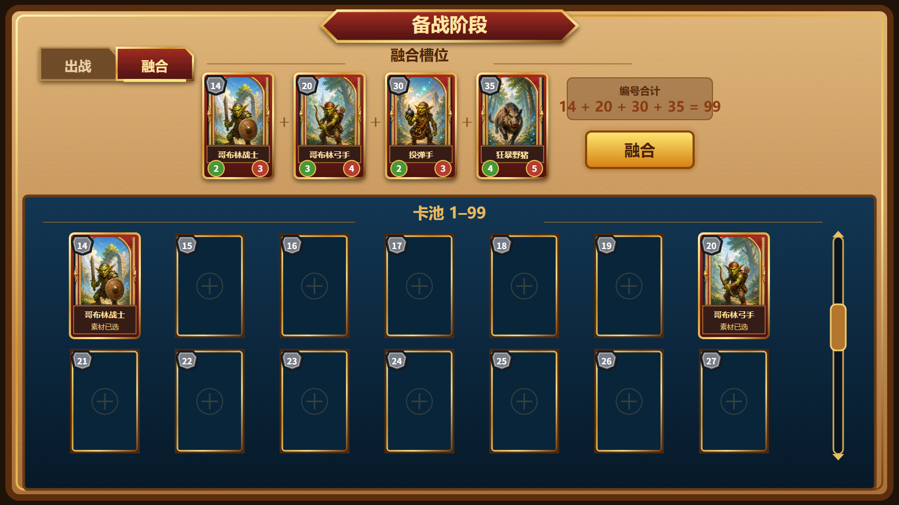

title: 备战阶段卡牌融合
state: Completed
priority: P0
plan: AutoDoc/DesignPlan/Plan/preparation-stage-card-fusion-plan.md
review: AutoDoc/DesignPlan/Review/preparation-stage-card-fusion-review.md

## 1. 需求简述

在备战阶段增加“融合”玩法，使玩家能够把普通卡的编号和值转化为组合目标：使用 2～4 张已拥有卡作为素材，当素材编号之和恰好为 `99` 时，可以消耗这些卡并获得唯一的 99 号卡。99 号卡的攻击和血量分别继承为全部素材卡对应属性之和。

该玩法让卡牌编号不只承担收藏定位作用，也成为玩家在备战阶段进行组合决策的资源。玩家需要在保留现有阵容、消耗普通卡和制造高属性 99 号卡之间做出取舍。

本策划案是[备战阶段卡池编成](preparation-stage-card-pool.md)的独立增量功能：普通卡仍使用 `1~98` 编号，融合结果使用固定编号 `99`。本篇不重新设计出战拖拽、普通卡编号分配、普通卡数值、99 号卡的独立技能、商店或下一轮流程。

## 2. 对应游戏场景

本玩法发生在单轮战斗结束后的备战阶段。

1. 玩家进入备战阶段时，左上角显示“出战”和“融合”两个页签，默认进入“出战”页签。
2. 玩家点击“融合”页签后，页面上方切换为最多 4 个融合槽位，下方继续显示共享的编号卡池。
3. 玩家从卡池中把 2～4 张 `1~98` 号已拥有卡拖入融合槽，页面实时显示当前素材编号之和与融合按钮状态。
4. 当编号和恰好为 `99` 时，融合按钮亮起；玩家点击后消耗素材并获得 99 号卡。
5. 融合完成后，玩家可切回“出战”页签，把新获得的 99 号卡用于后续编成。

切换页签不会离开备战阶段，也不会重复触发本轮发卡。未执行融合前，融合槽选择会在本次备战阶段内保留；离开备战阶段时未执行的选择自动清空，素材不被消耗。

## 3. 玩法原型图

图 1：玩家已选择 14、20、30、35 号四张素材卡，编号合计为 `99`，因此融合按钮亮起；左上角可切换“出战/融合”页签，下方继续显示共享编号卡池。

## 4. 玩法详细设计

### 4.1 双页签结构

- “出战”和“融合”两个页签固定显示在备战页面左上角。
- 当前页签使用明显的选中底框或高亮，未选页签保持可点击但视觉层级降低。
- “出战”页签沿用既有 3 个战斗槽位编成页面；“融合”页签显示 4 个融合槽位、编号合计反馈和融合按钮。
- 两个页签共享同一份玩家卡池与持有状态。融合成功造成的卡牌消耗和 99 号卡获得，会立即反映到两个页签。
- 页签切换只改变上方操作区域，不改变当前备战阶段、不重复发牌，也不修改尚未确认的编成或融合选择。

### 4.2 融合素材槽

1. 融合页固定显示 4 个等尺寸槽位，允许放入 2～4 张素材卡。
2. 只有玩家已拥有的 `1~98` 号卡可以进入融合槽；99 号卡不能作为素材。
3. 同一张卡不能同时进入多个融合槽。已被选中的卡在下方卡池显示清晰的“素材已选”状态。
4. 将卡拖入空融合槽时，该卡进入目标槽，但仍未被消耗。
5. 将卡拖入已有素材的融合槽时，新卡替换该槽原素材；原素材恢复为未选择状态，不被消耗。
6. 玩家可将融合槽中的卡拖回卡池区域以取消选择；取消后编号合计立即更新。
7. 第 5 张素材无法进入融合区，当前 4 个槽位与已有素材保持不变。

### 4.3 编号合计与按钮状态

页面持续显示当前素材编号合计，目标值固定为 `99`。

| 当前状态 | 编号合计 | 融合按钮 | 玩家可执行结果 |
| --- | --- | --- | --- |
| 素材少于 2 张 | 任意 | 置灰 | 不可融合 |
| 已有 2～4 张素材 | 小于 `99` | 置灰 | 可继续增加或替换素材 |
| 已有 2～4 张素材 | 恰好等于 `99` | 亮起 | 可点击并执行融合 |
| 已有 2～4 张素材 | 大于 `99` | 置灰 | 需要移除或替换素材 |
| 玩家已经持有 99 号卡 | 任意 | 置灰 | 不可再次融合 |

每次素材进入、离开或被替换时，编号合计和按钮状态必须同步更新。按钮置灰时点击不产生素材消耗、卡池变化或结果卡。

### 4.4 融合成功

当 2～4 张素材编号之和恰好为 `99`，且玩家尚未持有 99 号卡时，点击亮起的融合按钮执行以下结果：

1. 当前融合槽中的全部素材卡被消耗，玩家不再持有这些编号的卡；其原编号位置恢复为空槽。
2. 若某张素材卡同时处于出战槽，该出战槽同步清空，不允许已消耗卡继续参与下一轮战斗。
3. 玩家获得一张固定编号为 `99` 的新卡，卡池末尾的 99 号位置由空槽变为完整卡面。
4. 99 号卡的攻击等于全部素材卡在融合前显示的永久攻击之和。
5. 99 号卡的血量等于全部素材卡在融合前显示的永久血量之和。
6. 单轮战斗中的临时攻击、临时血量、伤害或增减益不计入融合结果。
7. 融合完成后 4 个素材槽清空，编号合计回到初始状态，融合按钮恢复置灰。
8. 同一玩家最多持有一张 99 号卡；持有期间不能再次执行融合。

例如素材编号为 `14、20、30、35`，编号和为 `99`；素材攻击分别为 `2、3、2、4`，血量分别为 `3、4、3、5`，则融合结果为编号 `99`、攻击 `11`、血量 `15`。

### 4.5 中断与异常操作

- 在按钮未亮起时点击，不改变素材槽、卡池、出战槽或玩家持有状态。
- 尝试放入未拥有卡、99 号卡、重复素材或第 5 张素材时，操作失败且已有槽位状态保持不变。
- 切回“出战”页签再返回“融合”页签时，本次备战阶段内尚未融合的素材选择和编号合计保持不变。
- 未执行融合便离开备战阶段时，所有融合槽选择取消，素材仍由玩家持有。
- 融合成功过程不可只完成一部分：不得出现素材已消耗但 99 号卡未获得，或 99 号卡已获得但素材仍保留的状态。

## 5. 所需配置项

| 配置项 | 策划含义 | 建议值或范围 | 玩家可见影响 |
| --- | --- | --- | --- |
| 备战页签 | 玩家在备战阶段可切换的功能页面 | 固定为“出战”“融合” | 左上角始终显示两个可选择页签 |
| 融合槽位上限 | 一次可选择的最大素材数量 | 固定 `4` | 融合页上方显示 4 个素材槽 |
| 融合素材下限 | 允许进入成功条件的最少素材数量 | 固定 `2` | 单卡不能触发融合 |
| 素材编号范围 | 可以参与融合的普通卡编号 | 固定 `1~98` | 99 号卡无法放入融合槽 |
| 目标编号和 | 按钮亮起所需的素材编号合计 | 固定 `99` | 仅恰好等于 99 时可融合 |
| 融合结果编号 | 成功后获得的新卡编号 | 固定 `99` | 卡池末尾出现特殊 99 号卡 |
| 结果攻击规则 | 99 号卡攻击的计算口径 | 素材永久攻击之和 | 素材攻击越高，结果攻击越高 |
| 结果血量规则 | 99 号卡血量的计算口径 | 素材永久血量之和 | 素材血量越高，结果血量越高 |
| 99 号卡持有上限 | 同一玩家可拥有的 99 号卡数量 | 固定 `1` | 已持有时融合按钮保持不可用 |
| 未确认选择保留期 | 融合槽选择保持的时间范围 | 本次备战阶段内 | 切页保留，离开备战阶段后取消 |

## 6. 验收

### 6.1 验收方式

本策划案只使用 **流程log验收**。进入实际备战阶段，按玩家操作顺序完成页签切换、素材选择、编号和变化、按钮亮灭、融合成功与异常操作；流程日志必须逐步对应操作前状态、玩家操作和操作后结果。

| 日志流程 | 覆盖范围 | 对应场景与核心操作 |
| --- | --- | --- |
| A：页签与素材选择 | `FUNC-01`、`FUNC-02` | 进入备战阶段，依次切换出战/融合页签，放入、替换、移除素材并尝试第 5 张素材 |
| B：按钮条件 | `FUNC-03`～`FUNC-05` | 分别组成编号和小于 `99`、等于 `99`、大于 `99` 的 2～4 张素材组合，记录每次编号合计和按钮状态 |
| C：成功融合 | `FUNC-06`～`FUNC-08` | 使用 `14+20+30+35` 执行融合，记录素材、攻血求和、消耗、出战槽变化和 99 号卡获得 |
| D：限制与中断 | `FUNC-09`、`FUNC-10` | 尝试放入 99 号卡、重复素材、未拥有卡，持有 99 号卡时再次融合，以及未融合离开备战阶段 |

`ART-01`～`ART-05` 不以流程日志替代玩家可见品质判断，按第 6.2 节所列资产编排检视完成；流程日志只负责证明对应状态能够按玩家流程被触发。

### 6.2 美术资产验收

| 编号 | 美术资产或资产组 | 前置场景 | 检视方式 | 预期玩家可见表现 | 通过条件 |
| --- | --- | --- | --- | --- | --- |
| `ART-01` | 出战/融合页签组 | 备战页面具备两个页签状态 | 检查相关资产编排：确认页签文字、底框、选中/未选状态、左上角布局和相互层级 | 左上角并列显示“出战”“融合”，当前页签清晰高亮，另一页签仍可识别可点击 | 两个页签文字完整、底框边界清楚，选中与未选状态差异不依赖文字颜色单一变化 |
| `ART-02` | 4 个融合槽位 | 融合页存在空槽、已占用槽和素材替换状态 | 检查相关资产编排：确认 4 槽尺寸、横向排列、空/占用/有效悬停状态及卡面引用组合 | 4 个等尺寸槽位形成单一融合区域，完整卡面进入后仍能辨认编号和攻血 | 4 槽尺寸、基线和间距一致；空槽、占用槽和有效目标状态资产齐备且无遮挡 |
| `ART-03` | 编号合计反馈 | 素材和分别小于、等于、大于 99 | 检查相关资产编排：确认合计文字、当前值、目标值及三类状态的层级和布局 | 玩家能持续看到当前编号和及目标 `99`，数值变化不引起布局跳动 | 三类状态均有完整编排，当前合计与目标值同时清晰可读，位置与图 1 一致 |
| `ART-04` | 融合按钮状态组 | 按钮处于置灰、亮起和按下状态 | 检查相关资产编排：确认按钮底框、文字、置灰/可用/按下状态引用与状态覆盖 | 等于 99 时按钮明显亮起，其他条件下保持置灰，按下时有即时反馈 | 三种状态资产齐备、尺寸一致；可用与不可用状态在页面整体配色中能够明确区分 |
| `ART-05` | 素材标记与 99 号结果卡 | 卡池存在已选素材，融合后出现 99 号卡 | 检查相关资产编排：确认“素材已选”状态、99 号完整卡面、灰色六边形编号、名称和攻血区域的引用与组合关系 | 已选素材不会与普通卡混淆；99 号卡在卡池末尾显示完整特殊卡面和编号 `99` | 素材状态标记不遮挡编号和属性；99 号卡资产齐备，编号、攻击、血量均有明确可见区域 |
| `ART-06` | 融合页面所需正式资产齐备性 | 融合页全部常态与交互状态已经编排 | 检查相关资产编排：逐项确认页签底框、融合槽、编号合计、融合按钮各状态、素材标记和 99 号卡没有缺失、占位或临时无框表现 | 所有玩家可见元素均由完整正式资产组成，并覆盖策划要求的全部状态 | 任一所需资产尚不存在时，必须先补齐对应正式资产及必要状态；缺失、占位或临时无框资产一律不得判定通过 |

`ART-01`～`ART-06` 只判断资产齐备性、引用组合、布局和状态覆盖；页签、按钮和结果是否按规则变化由对应 `FUNC-` 项判断。美术资产缺失不是跳过验收的理由：凡本篇要求但项目尚无可用正式资产的内容，均须补充正式资产后再验收。

### 6.3 程序功能验收

| 编号 | 前置场景 | 玩家操作 | 预期结果 | 通过条件 |
| --- | --- | --- | --- | --- |
| `FUNC-01` | 进入备战阶段 | 依次点击“融合”“出战”并再次返回“融合” | 页面在两个页签间切换，不离开备战阶段，不重复发牌；未融合素材选择在本次备战阶段内保留 | 流程日志依次记录页签变化、阶段未改变、发牌次数未增加和素材槽内容保持一致 |
| `FUNC-02` | 融合页有足够已拥有卡 | 放入、替换、移除素材，并尝试放入第 5 张 | 4 个槽位按操作更新；替换和移除不消耗卡；第 5 张无法进入 | 每步日志列明 4 槽内容和持有状态；任一步均无重复素材或超过 4 张素材 |
| `FUNC-03` | 已放入 2～4 张素材 | 组成编号和小于 `99` 的组合 | 页面显示实际编号和，融合按钮置灰 | 日志中的素材编号求和与显示值一致，按钮状态为不可用，点击后持有状态不变 |
| `FUNC-04` | 玩家未持有 99 号卡 | 组成 `14+20+30+35=99` | 页面显示编号和 `99`，融合按钮亮起 | 日志列出的 4 张素材之和精确为 `99`，按钮状态由不可用变为可用且尚未消耗素材 |
| `FUNC-05` | 已放入 2～4 张素材 | 组成编号和大于 `99` 的组合 | 页面显示实际编号和，融合按钮置灰 | 日志中的求和结果大于 `99`，按钮不可用，点击后素材、卡池和出战槽不变 |
| `FUNC-06` | `14+20+30+35=99` 且按钮已亮起 | 点击融合按钮 | 四张素材被消耗，融合槽清空，玩家获得唯一的 99 号卡，按钮恢复置灰 | 单次流程日志同时记录消耗编号集合、结果编号 `99`、融合槽清空和持有状态变化，不存在部分完成 |
| `FUNC-07` | 四张素材攻击为 `2/3/2/4`，血量为 `3/4/3/5` | 成功执行融合 | 99 号卡攻击为 `11`、血量为 `15` | 日志记录融合前各素材永久攻血和融合后结果攻血；两项分别等于对应素材之和 |
| `FUNC-08` | 至少一张素材当前位于出战槽 | 使用包含该卡的合法组合执行融合 | 被消耗素材的卡池编号位置变为空槽，对应出战槽同步清空，其他出战槽不变 | 日志能对应消耗素材、变空的编号位置和被清空的出战槽；未作为素材的卡与槽位保持原状态 |
| `FUNC-09` | 融合页可操作，或玩家已经持有 99 号卡 | 尝试放入 99 号卡、重复素材、未拥有卡；持有 99 号卡时组成合法编号和 | 非法素材不能进入；已持有 99 号卡时按钮保持置灰且不能再次产出 | 每次尝试日志均记录拒绝原因和前后状态一致；99 号卡持有数量始终不超过 1 |
| `FUNC-10` | 融合槽已有素材但按钮未执行 | 切换页签后返回，再离开备战阶段 | 切页后素材保留；离开阶段后选择清空且素材不被消耗 | 日志记录切页前后素材一致、离开阶段后的槽位清空，以及玩家持有状态与离开前一致 |
