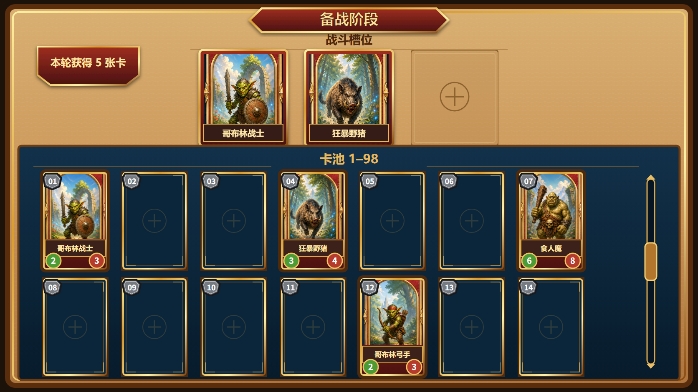

title: 备战阶段卡池编成
state: Completed
priority: P0
plan: AutoDoc/DesignPlan/Plan/preparation-stage-card-pool-plan.md
review: AutoDoc/DesignPlan/Review/preparation-stage-card-pool-review.md

## 1. 需求简述

单轮战斗结束后，玩家需要进入独立的备战阶段，查看自己在 `1~98` 稳定编号卡池中的持有情况，并为下一轮战斗配置最多 3 张卡牌。玩家通过直接拖拽完成编成；目标战斗槽已有卡牌时，新卡立即替换旧卡，避免额外确认步骤。

本玩法的目标是让玩家能够快速理解“拥有哪些卡、哪些卡已经进入阵容、下一轮将使用哪 3 张卡”，同时保持完整卡面的收藏浏览体验。页面构图与视觉表现以本策划案第 3 章的等宽七列原型为基准。

本策划案不负责卡牌编号的随机分配、卡牌种类与数值平衡、食人魔数值、商店、费用、出售、刷新、锁定、升级或下一轮按钮规则。

## 2. 对应游戏场景

本玩法发生在单轮战斗结束与下一轮战斗开始之间。

1. 单轮战斗结算完成后，本轮奖励向玩家发放 5 张卡。
2. 玩家进入“备战阶段”页面，页面上方显示 3 个战斗槽位，下方显示 `1~98` 编号卡池。
3. 玩家可以滚动卡池、查看已有卡牌和缺失编号，并将已有卡牌拖入战斗槽位。
4. 玩家可以反复调整 3 个槽位；拖入已占用槽位时直接完成替换。
5. 完成编成后，页面保留最终 3 槽状态，供后续既有流程进入下一轮战斗。本策划案不新增或定义下一轮入口。

页面常态下，上方战斗区始终可见；卡池在下方独立面板内纵向滚动，使玩家调整阵容时不需要切换页面。

## 3. 玩法原型图

图 1：备战阶段常态页面。上方为 3 个战斗槽位，下方为带底框和滚动条的 `1~98` 编号卡池；首屏按七列展示两排完整等宽卡面或空槽。

## 4. 玩法详细设计

### 4.1 页面信息与布局

- 页面顶部中央显示“备战阶段”。文字必须置于独立底框之上，形成清晰的阶段标题。
- 标题下方为“战斗槽位”区域。“战斗槽位”文字位于左右横向装饰线之间，区域内横向排列恰好 3 个等尺寸槽位。
- 页面下半部为卡池列表。卡池整体置于完整底框内，右侧显示明确的纵向滚动条。
- 卡池固定按编号 `01~98` 从左到右、从上到下排列，每排 7 个位置。
- 玩家持有对应编号卡牌时，该位置展示完整 `2:3` 竖向卡面，包括立绘、名称、攻击、血量和左上角灰色六边形编号。
- 玩家未持有对应编号卡牌时，该编号位置显示同尺寸空槽；后续编号不前移、不补位。
- 已拥有卡与空槽必须严格等宽等高，所有列与行保持统一间距。
- 页面显示“本轮获得 5 张卡”的可见反馈，使玩家明确本次进入备战阶段获得的奖励数量。

### 4.2 卡池浏览规则

1. 卡池始终以编号顺序呈现，不提供改变排序的入口。
2. 玩家可通过滚动条或常规纵向滚动操作浏览后续编号，直至 `98`。
3. 滚动卡池不会改变上方战斗槽位的可见状态。
4. 在卡牌上开始拖动时，操作解释为卡牌拖拽；在非卡牌区域滚动时，操作解释为列表浏览。
5. 发放新卡后，对应编号位置由空槽更新为完整卡面，其他编号位置保持不变。

### 4.3 拖入空槽

1. 玩家按住一张已拥有卡牌并开始拖动时，卡牌进入拖起状态，与静态卡池卡牌产生清晰区分。
2. 卡牌经过可放置的战斗槽时，该槽显示明确的有效目标高亮。
3. 玩家在空战斗槽上释放卡牌后，该卡进入目标槽位并以完整卡面显示。
4. 卡牌进入战斗槽不改变玩家对该卡的所有权，也不改变 `1~98` 卡池中的稳定编号位置。
5. 同一编号卡牌同一时间只能占据一个战斗槽。

### 4.4 拖入已占用槽位

1. 玩家把新卡释放到已有卡牌的战斗槽时，不弹出二次确认，立即用新卡替换原卡。
2. 被替换卡从战斗槽移出，恢复为未上阵状态；玩家仍然拥有该卡，其编号卡池位置仍可继续选择。
3. 替换后目标槽只显示新卡，不允许两张卡叠放或同时占用同一槽位。
4. 若拖动的是已经位于其他战斗槽的卡牌，则先从原槽移出，再放入目标槽；目标槽原有卡牌按相同替换规则恢复为未上阵状态。

### 4.5 无效拖放与状态限制

- 卡牌释放在战斗槽以外、页面外或其他不可放置区域时，本次操作取消，3 个战斗槽状态保持不变。
- 未拥有的空编号槽不能被拖动。
- 战斗槽位上限固定为 3；不能通过重叠、重复拖拽或换槽产生第 4 张上阵卡。
- 拖起态、目标高亮和释放结果必须即时可见，不得出现卡牌已经替换但页面仍显示旧卡的状态。

## 5. 所需配置项

| 配置项 | 策划含义 | 建议值或范围 | 玩家可见影响 |
| --- | --- | --- | --- |
| 战斗槽位数量 | 玩家下一轮可编成的卡牌数量上限 | 固定 `3` | 页面上方始终显示 3 个槽位 |
| 卡池编号范围 | 卡池中稳定展示的编号总范围 | 固定 `1~98` | 玩家可按固定位置识别持有与缺失卡牌 |
| 每排卡位数量 | 完整卡面模式下的横向浏览密度 | 固定 `7` | 首屏可同时看到更多连续编号且保持卡面完整 |
| 卡位宽高比例 | 已拥有卡与空槽的统一轮廓 | 固定 `2:3` | 卡牌与空槽等宽等高，不产生布局跳动 |
| 每轮发卡数量 | 每次进入备战阶段新增的卡牌数量 | 固定 `5` | 页面显示本轮获得 5 张卡，并更新对应编号位置 |
| 放置冲突规则 | 目标槽已有卡牌时的处理方式 | 固定为直接替换 | 玩家无需确认即可快速调整阵容 |
| 单卡占位上限 | 同一编号卡可同时占据的战斗槽数量 | 固定 `1` | 同一张卡不能重复出现在多个战斗槽 |

## 6. 验收

### 6.1 验收方式

本策划案只使用 **游戏内截图** 验收。

| 截图组 | 覆盖范围 | 对应游戏场景与核心操作 |
| --- | --- | --- |
| A：备战常态 | `ART-01`～`ART-05`、`ART-07`、`FUNC-01`～`FUNC-03` | 完成一轮战斗并进入备战阶段，截取包含完整标题、3 个战斗槽、发卡反馈、首屏卡池和滚动条的全屏画面；再滚动至列表末段截取包含编号 `98` 的画面 |
| B：拖入空槽 | `ART-06`、`FUNC-04` | 从卡池拖动一张已有卡，分别截取悬停于空战斗槽时和释放后的画面 |
| C：替换占用槽 | `FUNC-05` | 先让目标槽存在卡牌，再拖入另一张卡；截取替换前与替换后的同一槽位画面，并同时保留被替换卡的卡池编号位置 |
| D：换槽与无效拖放 | `FUNC-06`～`FUNC-08` | 将已上阵卡拖向另一槽并完成换槽；另将卡牌释放到无效区域，分别截取操作前后状态 |

### 6.2 美术资产验收

| 编号 | 美术资产或资产组 | 前置场景 | 检视方式 | 预期玩家可见表现 | 通过条件 |
| --- | --- | --- | --- | --- | --- |
| `ART-01` | 阶段标题 | 进入备战阶段常态页 | 游戏内全屏截图，重点检视页面顶部 | “备战阶段”文字具有独立、完整、清晰可见的底框 | 标题居中，底框没有缺边、遮挡或与文字脱离，并与图 1 的红金标题结构一致 |
| `ART-02` | 战斗槽位标题与槽位组 | 进入备战阶段，至少保留一个空槽 | 游戏内全屏截图，重点检视页面上半区 | “战斗槽位”文字位于左右横向装饰线之间，下方恰好排列 3 个等尺寸槽位 | 两侧横线连续且对称地扩展标题区域；3 个槽位尺寸、基线和间距一致，与图 1 对齐 |
| `ART-03` | 卡池列表底框与滚动条 | 进入备战阶段并滚动卡池 | 常态截图与滚动后截图，重点检视页面下半区及右侧 | 卡池列表整体位于完整底框内，右侧滚动条清晰可见并具有轨道、滑块与方向提示 | 底框完整包围卡牌列表；滚动条不与卡牌重叠，常态与滚动状态均保持清晰，与图 1 对齐 |
| `ART-04` | 七列完整卡面、空槽与编号牌 | 卡池中同时存在已拥有与未拥有编号 | 游戏内首屏截图，重点检视两排卡位 | 每排 7 个 `2:3` 竖向卡位；已拥有卡展示完整卡面，缺失卡展示同尺寸空槽；编号牌为灰色六边形 | 14 个首屏卡位严格等宽等高，列距和行距一致；编号连续、清楚且不遮挡核心卡面信息 |
| `ART-05` | 备战页面整体视觉 | 进入备战阶段常态页 | 游戏内全屏截图与图 1 并排检视 | 羊皮纸主界面、红金标题与卡框、深蓝卡池、灰色编号牌及上下区构图形成统一风格 | 页面层级、区域比例、颜色关系、装饰语言和关键元素位置与图 1 一致，无额外常驻控件破坏构图 |
| `ART-06` | 拖起态与有效目标高亮 | 正在把已有卡拖向战斗槽 | 游戏内拖拽悬停截图 | 被拖卡与静态卡牌有清晰层级差，有效目标槽产生可辨识高亮，同时不遮挡槽位和卡牌关键信息 | 玩家仅凭截图能指出正在拖动的卡和当前目标槽；高亮风格与页面红金体系协调 |
| `ART-07` | 备战页面所需正式资产齐备性 | 完成备战页面常态、滚动与拖拽状态 | 检视 A～D 全部游戏内截图，重点确认标题底框、横线、槽位、卡池底框、滚动条、编号牌和拖拽反馈没有缺失或临时占位 | 所有要求的玩家可见元素都使用完整正式资产，不出现裸文字、无框默认控件、缺图、临时色块或占位框 | 任一所需资产尚不存在时，必须先补齐对应正式资产并重新形成截图；缺失、占位或临时无框状态一律不得判定通过 |

`ART-01`～`ART-07` 只判断玩家可见的资产与画面品质；其运行时触发和状态正确性分别由相关 `FUNC-` 项判断。美术资产缺失不是跳过验收的理由：凡本篇要求但项目尚无可用正式资产的内容，均须补充正式资产后再验收。

### 6.3 程序功能验收

| 编号 | 前置场景 | 玩家操作 | 预期结果 | 通过条件 |
| --- | --- | --- | --- | --- |
| `FUNC-01` | 单轮战斗即将结束 | 完成该轮战斗 | 结算后进入备战阶段，本轮只发放一次 5 张卡，并显示对应反馈 | 前后截图能够对应战斗结束与备战页面；备战截图显示“本轮获得 5 张卡”，不存在重复发放后的额外变化 |
| `FUNC-02` | 已进入备战阶段，玩家持有部分编号卡 | 查看卡池首屏 | 卡池按 `01~98` 稳定排序；已有编号显示卡面，未有编号保留空槽 | 截图中编号连续，缺失位置未被后续卡牌补位，已拥有与空槽的编号位置可判定 |
| `FUNC-03` | 卡池首屏可见 | 向下滚动直至列表末尾 | 卡池顺序连续延伸至 `98`，上方战斗槽保持可见且内容不变 | 首尾截图能够证明列表从首段滚动至包含 `98` 的末段；滚动前后战斗槽状态一致 |
| `FUNC-04` | 至少有一个空战斗槽和一张可用卡 | 将该卡拖至空槽并释放 | 卡牌进入目标槽，其他槽不受影响，同一卡未出现在第二个战斗槽 | 悬停截图显示有效目标；释放后截图只在目标槽新增该卡，3 槽总占用数正确 |
| `FUNC-05` | 目标战斗槽已有卡牌，卡池另有一张可用卡 | 将新卡拖至已占用槽并释放 | 新卡立即替换原卡；原卡恢复未上阵状态并仍属于玩家 | 替换前后截图显示目标槽从原卡变为新卡、没有叠卡；被替换卡的编号卡池位置仍显示完整卡面 |
| `FUNC-06` | 一张卡已位于某战斗槽，另一目标槽为空或已占用 | 将已上阵卡拖到另一目标槽 | 原槽清空，卡牌进入目标槽；若目标槽原有卡，则原有卡按替换规则恢复未上阵 | 操作前后截图能够一一对应原槽、目标槽和被替换卡状态；同一卡只占一个槽 |
| `FUNC-07` | 玩家正在拖动一张可用卡 | 将卡释放到战斗槽之外 | 本次拖放取消，战斗槽编成保持操作前状态 | 操作前后截图中的 3 个槽位内容完全一致，没有卡牌丢失、复制或错误替换 |
| `FUNC-08` | 3 个战斗槽已占满 | 继续拖入新卡，并重复尝试同卡换槽 | 新卡只按目标槽执行替换；任何时刻最多 3 张卡上阵，同一编号卡最多占 1 个槽 | 操作后截图中战斗槽仍恰好为 3 个且无叠放，同一编号没有出现在多个槽位 |

## 7. 实现方式建议

建议使用新的 GameStage 承载备战阶段，使其作为单轮战斗结束与下一轮战斗开始之间的独立阶段。该建议只表达阶段承载方向，不构成实施技术定案；具体阶段切换、数据交接和页面接入方式应在进入实施流程后结合项目框架另行核验。
