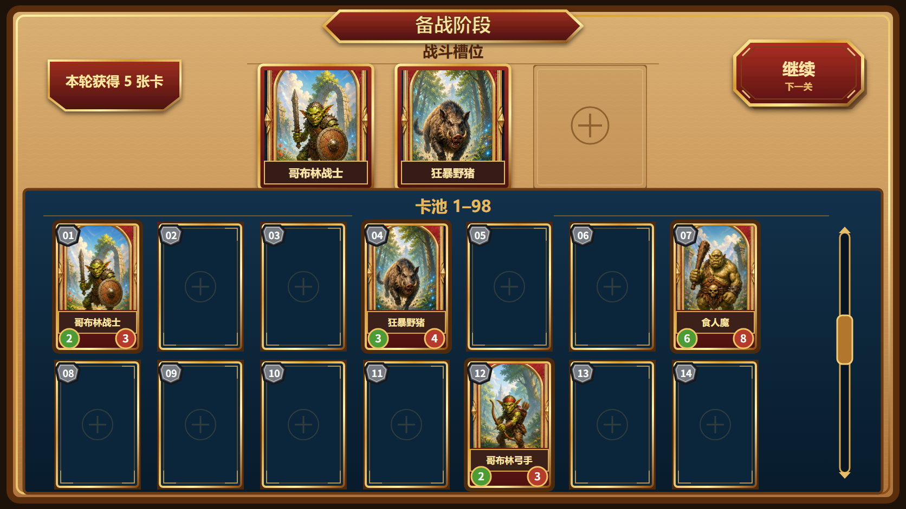

title: 备战阶段继续下一关
state: In Design
priority: P1

## 1. 需求简述

在备战阶段右上角增加常驻“继续”按钮，为玩家提供明确、统一的备战结束入口。玩家点击后提交当前出战编成并进入下一关，不需要额外确认。

继续按钮需要与已确认的备战原画保持一致：使用红色面板、暖金描边、切角轮廓和清晰阴影构成完整外框，不能以裸文字或无框默认按钮代替。如果项目中没有满足标准的按钮外框或状态资产，必须补充正式美术资产后才能通过验收。

本策划案依赖[备战阶段卡池编成](preparation-stage-card-pool.md)提供当前出战阵容，并与[备战阶段卡牌融合](preparation-stage-card-fusion.md)共享备战页面。本篇只负责结束备战和推进下一关，不重新设计出战、融合、奖励结算或下一关战斗内容。

## 2. 对应游戏场景

本功能发生在玩家进入备战阶段后，直至离开备战阶段前。

1. 备战页面加载完成后，右上角显示“继续”按钮。
2. 玩家在“出战”或“融合”页签进行调整时，按钮始终保持在页面右上角，不随卡池滚动，也不因切换页签消失。
3. 玩家完成或放弃当前调整后点击“继续”，系统以点击瞬间的出战槽状态作为下一关阵容。
4. 点击成功后离开备战阶段并进入下一关。
5. 若下一关未能进入，玩家继续停留在备战阶段，原阵容和卡池状态保持不变，可以再次点击继续。

本篇不新增“必须填满 3 个出战槽”的限制。0～3 个出战槽占用状态均可点击继续，下一关使用当前实际阵容。

## 3. 玩法原型图

图 1：继续按钮固定在备战阶段右上角，使用与阶段标题和现有面板一致的红金切角外框；按钮位于卡池滚动区域之外，不遮挡战斗槽和卡牌列表。

## 4. 玩法详细设计

### 4.1 按钮布局与显示

- 按钮固定在备战页面右上角，位于卡池列表底框之外。
- 按钮主文字为“继续”，辅助文字为“下一关”，两者均位于完整外框内。
- 按钮在“出战”和“融合”两个页签下使用同一位置、尺寸和视觉层级。
- 卡池滚动、卡牌拖拽和融合素材选择不会移动、遮挡或隐藏继续按钮。
- 按钮外框沿用图 1 所示红色面板、暖金描边、切角轮廓和阴影语言，与“备战阶段”标题底框属于同一视觉体系。

### 4.2 点击继续

1. 玩家进入备战阶段且页面可操作后，继续按钮可点击。
2. 玩家点击时，以该时刻 3 个出战槽中的实际卡牌作为下一关阵容；空槽保持为空。
3. 不要求 3 个出战槽全部填满，也不弹出二次确认。
4. 第一次有效点击后，按钮立即进入等待状态，不再接受重复点击。
5. 备战阶段结束，当前关卡只推进一次，玩家进入紧接着的下一关。
6. 进入下一关后，不再次触发本轮备战发卡，也不重复创建下一关。

### 4.3 与融合页的关系

- 继续按钮在融合页签中仍保持可见和可用。
- 玩家点击继续时，已经成功获得的 99 号卡与已经发生的素材消耗正常保留。
- 尚未点击融合按钮的融合槽选择属于未确认状态；点击继续离开备战阶段时，这些选择自动取消，素材不被消耗。
- 未确认的融合槽内容不改变出战阵容，也不会阻止玩家继续下一关。

### 4.4 重复点击与失败回退

- 按钮进入等待状态后，连续点击、双击或其他重复输入均不再次推进关卡。
- 若下一关成功进入，等待状态随备战页面关闭而结束。
- 若下一关未能进入，玩家停留在原备战页面；当前出战槽、卡池、已完成融合结果和未消耗卡牌均保持点击前状态。
- 失败回退完成后，继续按钮恢复可用，玩家可以再次尝试。

## 5. 所需配置项

| 配置项 | 策划含义 | 建议值或范围 | 玩家可见影响 |
| --- | --- | --- | --- |
| 按钮主文字 | 玩家识别结束备战操作的主要标签 | 固定“继续” | 玩家能快速找到离开备战阶段的入口 |
| 按钮辅助文字 | 说明继续操作的目标 | 固定“下一关” | 明确点击后将推进关卡 |
| 按钮位置 | 按钮在备战页面的固定区域 | 右上角 | 两个页签均可随时看到按钮 |
| 页签覆盖范围 | 按钮需要出现的备战页面 | “出战”“融合”均显示 | 切换页签不会失去继续入口 |
| 阵容完整度限制 | 允许继续时的出战槽占用数量 | `0~3` | 不必填满阵容即可进入下一关 |
| 点击确认 | 点击后是否需要二次确认 | 不需要 | 玩家一次点击即可推进 |
| 重复输入限制 | 等待转场时是否接收再次点击 | 不接收 | 防止连续进入多关或重复创建下一关 |
| 失败回退 | 下一关未进入时的页面状态 | 保留备战状态并恢复按钮 | 玩家不会因失败丢失阵容或卡牌状态 |

## 6. 验收

### 6.1 验收方式

本策划案只使用 **流程log验收**。进入实际备战阶段，按玩家流程在两个页签中操作继续按钮，并以能够对应点击前阵容、按钮状态、阶段变化、关卡变化和失败回退的流程日志作为主要证据。

| 日志流程 | 覆盖范围 | 对应场景与核心操作 |
| --- | --- | --- |
| A：常驻入口 | `FUNC-01` | 进入备战阶段，切换“出战/融合”页签并滚动卡池，记录继续按钮可用状态 |
| B：正常推进 | `FUNC-02`、`FUNC-03`、`FUNC-07` | 分别使用 0、1、3 张出战卡点击继续，记录提交阵容、阶段退出、下一关进入和发卡次数 |
| C：融合未确认状态 | `FUNC-04` | 在融合槽放入素材但不执行融合，点击继续并记录素材持有状态和下一关阵容 |
| D：重复输入与失败回退 | `FUNC-05`、`FUNC-06` | 连续点击继续，并构造一次下一关无法进入的结果，记录推进次数、按钮恢复和备战状态 |

`ART-01`～`ART-03` 不以流程日志替代玩家可见品质判断，按第 6.2 节的资产编排检视完成；流程日志只证明对应按钮状态和页面位置能够在实际玩家流程中出现。

### 6.2 美术资产验收

| 编号 | 美术资产或资产组 | 前置场景 | 检视方式 | 预期玩家可见表现 | 通过条件 |
| --- | --- | --- | --- | --- | --- |
| `ART-01` | 继续按钮正式外框 | 已确定图 1 的右上角按钮构图 | 检查相关资产编排：确认红色面板、暖金描边、切角轮廓、阴影、文字层级和组合关系 | 按钮具有与原画一致的完整红金外框，主文字“继续”和辅助文字“下一关”均位于框内 | 外框颜色、切角、描边和阴影与图 1 一致；如果当前没有满足标准的外框资产，必须补充新的正式外框资产，裸文字、默认按钮或临时无框表现不得通过 |
| `ART-02` | 继续按钮状态组 | 按钮分别处于常态、悬停、按下和等待状态 | 检查相关资产编排：确认四种状态的底框引用、尺寸一致性、文字位置、亮度与按压反馈 | 玩家能识别按钮是否可操作以及点击是否已被接受，状态切换不引起位置或尺寸跳动 | 四种状态资产齐备且风格统一；若任一状态资产不存在，必须补齐正式状态资产后再验收，不得复用缺乏区分度的临时色块 |
| `ART-03` | 按钮跨页签布局 | 出战页、融合页和卡池不同滚动位置 | 检查相关资产编排：确认按钮在两个页面的锚定位置、层级、与标题/槽位/卡池底框的间距和遮挡关系 | 按钮始终位于右上角、处于卡池滚动区外，并与两种页签构图保持一致 | 两个页签中按钮位置和尺寸一致；不遮挡标题、战斗槽、融合槽或卡池，且不被滚动内容覆盖 |

`ART-01`～`ART-03` 只判断正式资产齐备性、引用组合、状态覆盖和玩家可见品质；按钮点击和关卡推进由相关 `FUNC-` 项判断。美术资产缺失不是跳过验收的理由：凡本篇要求但项目尚无可用正式资产的内容，均须补充正式资产后再验收。

### 6.3 程序功能验收

| 编号 | 前置场景 | 玩家操作 | 预期结果 | 通过条件 |
| --- | --- | --- | --- | --- |
| `FUNC-01` | 已进入备战阶段 | 在出战/融合间切换并滚动卡池 | 继续按钮始终可用且保持右上角常驻，不随页签或滚动状态消失 | 流程日志记录两页签及不同滚动位置下按钮均存在、可用且未触发关卡变化 |
| `FUNC-02` | 出战槽分别占用 0、1、3 张卡 | 点击继续 | 每种阵容都能结束备战并进入下一关，不因空槽阻止操作 | 三次独立流程日志分别记录点击前占用数、提交阵容和成功进入下一关 |
| `FUNC-03` | 出战槽含已选择卡牌 | 点击继续并进入下一关 | 下一关使用点击瞬间的卡牌编成，空槽保持为空 | 日志中的提交阵容与下一关实际使用阵容逐槽一致，没有新增、丢失或重复卡牌 |
| `FUNC-04` | 融合槽已有素材但尚未点击融合 | 点击继续 | 未确认融合选择取消，素材不被消耗；当前出战阵容正常进入下一关 | 日志记录离开前融合槽内容、离开后素材仍被持有、未产出 99 号卡，并记录实际提交阵容 |
| `FUNC-05` | 继续按钮可用 | 快速连续点击或双击继续 | 只接受第一次有效点击，只推进到紧接着的下一关一次 | 日志只出现一次备战退出、一次关卡递增和一次下一关进入，不存在重复推进 |
| `FUNC-06` | 下一关本次无法进入 | 点击继续 | 玩家停留在备战阶段，阵容与卡池不变，按钮恢复可用 | 日志记录关卡未递增、备战阶段未退出、点击前后阵容和持有状态一致，并记录按钮恢复 |
| `FUNC-07` | 本轮备战已完成 5 张卡发放 | 点击继续进入下一关 | 继续操作不重复发放本轮奖励，也不重复创建下一关 | 日志记录点击前后本轮发卡次数不增加，下一关只创建并进入一次 |
