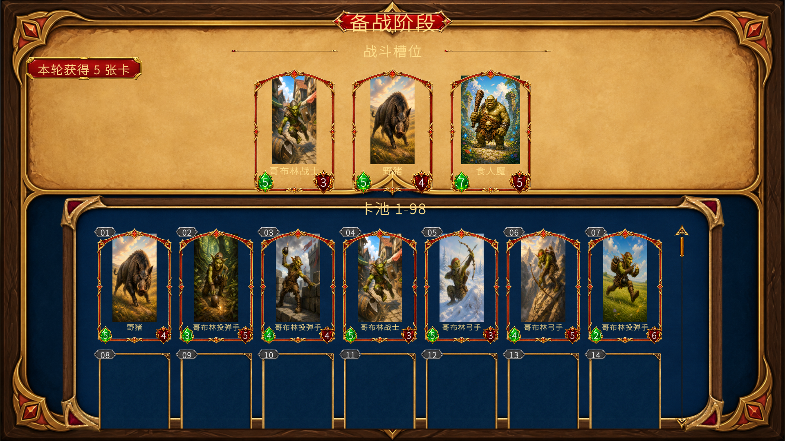
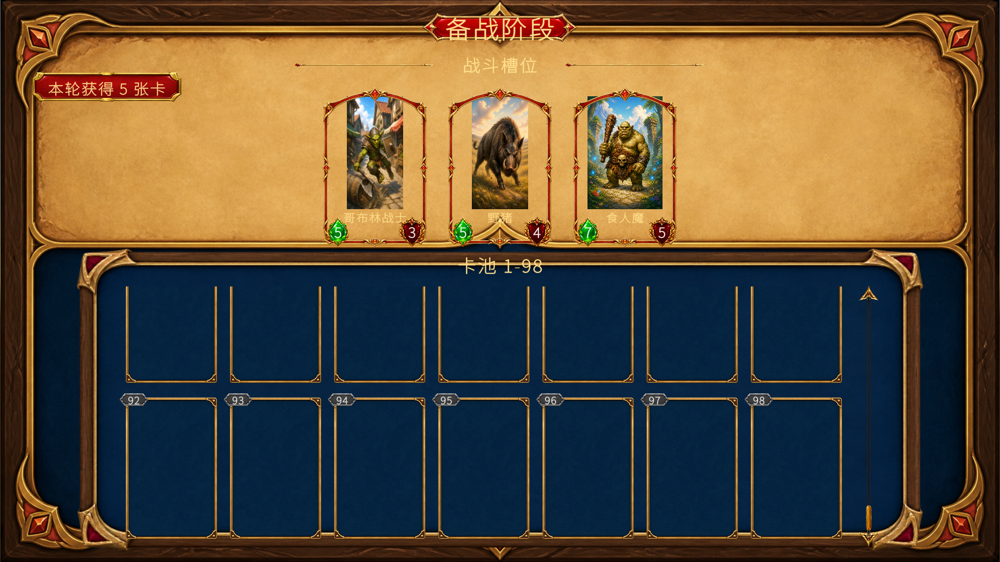
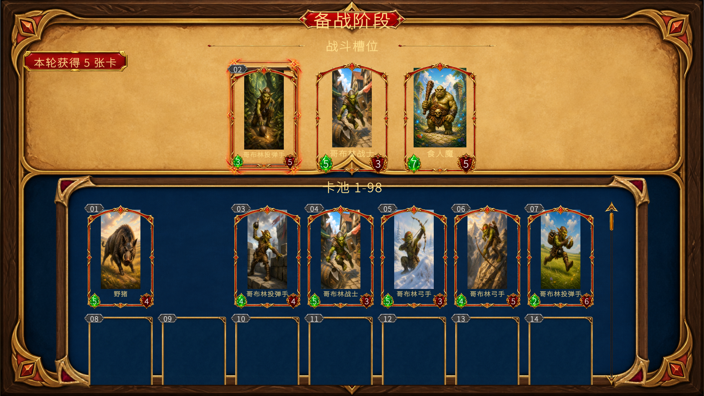
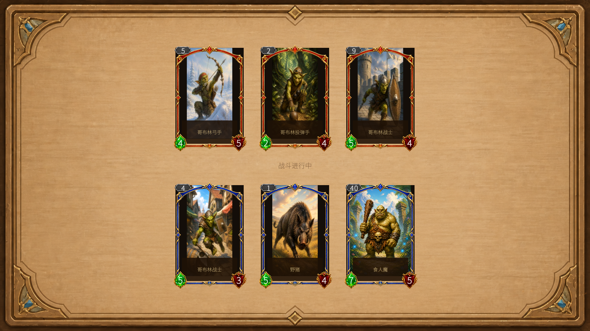
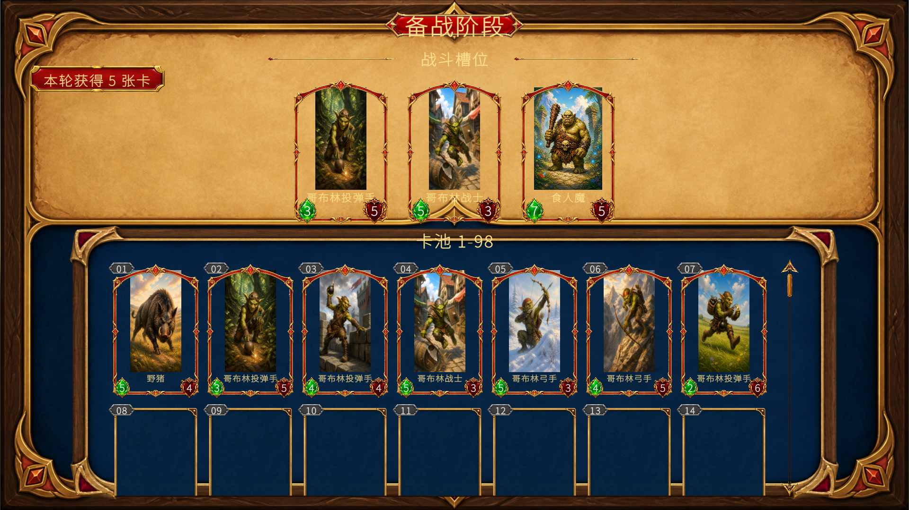
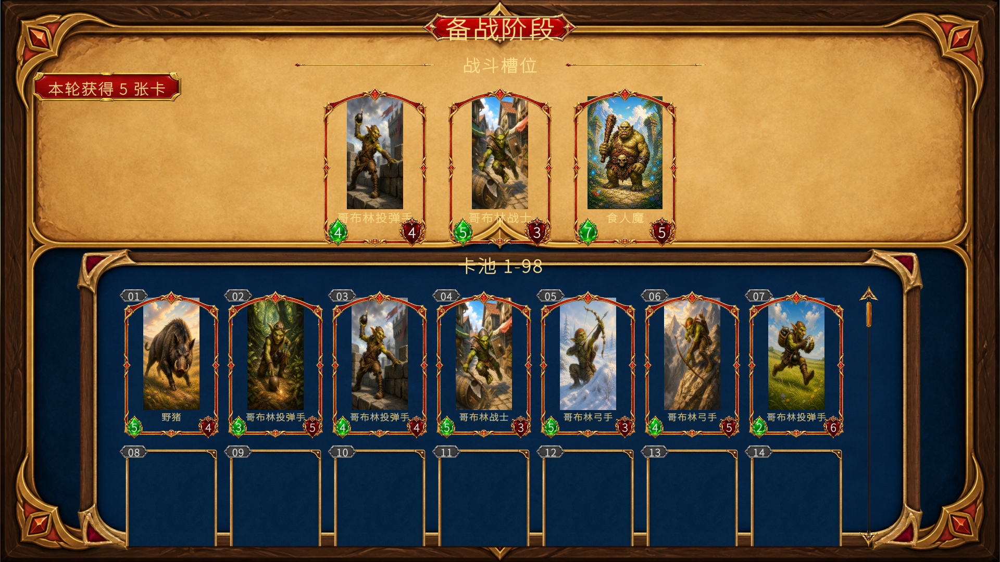
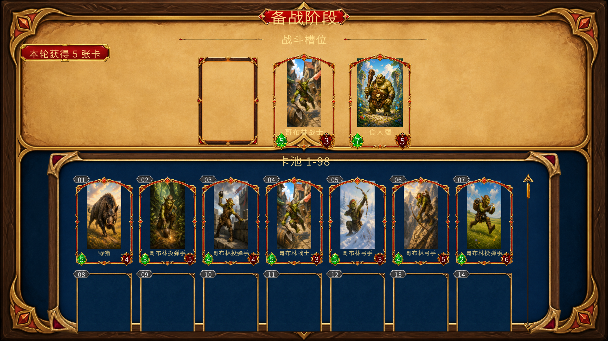

## 1. 实现方式

新增持久 RunState、战斗结算自动切换的备战 StageGroup，以及支持 98 卡池、3 槽编成和正式资源的可导出 UI。

## 2. 验收

### 2.1 验收方式

按策划案要求仅使用游戏内截图。通过 `GameStageEntryLauncher.Start(Assets/Resources/Editor/InitialStageEntry.asset)` 启动正式 StageGroup，在实际 Play 中完成自动战斗、终局切换、卡池滚动和 PointerDown/Drag/PointerUp 拖放。

- Trip A：3v3 战斗 → 终局自动进入备战 → 首屏 → 滚至 98 → 同 batch 重提；覆盖 `ART-01`～`ART-05`、`ART-07`、`FUNC-01`～`FUNC-03`、`RGR-01`～`RGR-04`。
- Trip B：卡 02 悬停并释放到空槽；覆盖 `ART-06`、`FUNC-04`。
- Trip C：卡 03 替换槽内卡 02；覆盖 `FUNC-05`。
- Trip D：Slot→Slot 换槽、槽外释放、满槽继续替换及同卡换槽；覆盖 `FUNC-06`～`FUNC-08`、`RGR-04`～`RGR-05`。

首次验收发现中文字体缺字；修正趟次 1 后中文可读，但滚至末段暴露 Viewport 裁切失败；修正趟次 2 通过标准 `Mask + RectMask2D` 闭环。最终退出 Play 后活动场景为干净的 `Main.unity`，Console error 为 0。

### 2.2 美术资产验收

- `ART-01` 通过：标题“备战阶段”居中于完整红金底框，文字清晰，无缺边或脱离。
- `ART-02` 通过：“战斗槽位”位于对称装饰线之间，下方始终恰好 3 个等尺寸槽框。
- `ART-03` 通过：深蓝卡池底框完整，滚动条的轨道、滑块与箭头清晰；滚至末段后不覆盖上方区域。
- `ART-04` 通过：首屏严格 7×2 个 2:3 卡位，01～14 连续；持有卡为完整卡面，缺失编号保留等尺寸空槽。
- `ART-05` 通过：羊皮纸上区、深蓝池区、红金卡框和木金外框形成统一层级，无额外常驻控件破坏构图。
- `ART-06` 通过：拖动卡 02 时卡牌位于顶层，左侧有效槽有清晰红金高亮，目标与拖动对象可辨。
- `ART-07` 通过：页面使用 11 张 Preparation 正式 Sprite、3 个独立 Prefab 及既有完整卡面资源；最终截图无乱码、缺图、默认控件、裸文字或临时占位。

常态与滚动证据：

拖拽高亮证据：

### 2.3 程序功能验收

- `FUNC-01` 通过：正式入口启动的实际 3v3 Battle 产生终局并自动进入 Preparation；页面显示“本轮获得 5 张卡”。同一 Play 重提 `initial-battle-reward-001` 前后均为 `owned=8、Revision=2、slots=4,1,40`，没有重复发放。
- `FUNC-02` 通过：首屏编号 01～14 连续，持有与缺失位置不互相补位；卡面显示 RunState 永久攻击与最大生命。
- `FUNC-03` 通过：向正式 `ScrollRect.OnScroll` 输入后到达 `verticalNormalizedPosition=0`，末段 92～98 可见，上方 3 槽内容和位置保持不变。
- `FUNC-04` 通过：真实事件链把卡 02 放入左侧空槽，状态从 `0,4,40` 变为 `2,4,40`，高亮在释放后关闭且无重复占槽。
- `FUNC-05` 通过：卡 03 替换左槽卡 02，状态从 `2,4,40` 变为 `3,4,40`；卡 02 在固定池位仍显示完整卡面。
- `FUNC-06` 通过：Slot→Slot 拖放把 `4,1,40` 变为 `0,4,40`，原槽清空，目标按替换规则更新，同一卡只占一个槽。
- `FUNC-07` 通过：卡 05 释放到槽外，状态前后均为 `3,4,40`，无丢失、复制或误替换。
- `FUNC-08` 通过：满槽继续替换并重复同卡换槽后，固定数组长度仍为 3、状态为 `0,5,40`，3 个槽框完整且无叠放或重复编号。

战斗与编成证据：

跨分类关联：Trip A 的截图同时证明正式资产编排和玩家可见状态，但 `ART-*` 画面品质与 `FUNC-*` 行为分别判定；静态测试和代码审查没有代替上述运行行为。

## 4. 详细审查意见

实现范围与 Plan 一致。RunState 由持久 `RunStateStage` 唯一持有；Battle/Preparation 使用完整 StageGroup 和短生命周期 session。5 张奖励通过强类型快照传递，应用前完整校验，按 BatchId 原子幂等；玩家后续 Battle 从 RunState 的 3 槽永久实例创建，敌方保留既有随机配置。

初始代码审查首轮发现 Stage 请求重入、`UiInteractor` 触摸目标未复位、Builder 私有反射和布局推导四项问题。修正后，BbxCommon 增加批次加载完成回调、公开强类型 UI Editor 导出入口，并补齐拖拽 TouchEnd；round 2 代码审查通过，未保留平行 Stage 执行器、业务私有反射或特定需求 trick。

首次游戏验收的中文缺字通过既有 `NotoSansSC-Dynamic SDF` 修复，round 3 复审通过。修正趟次 1 的滚动失败通过标准 Viewport 双 Mask 修复；round 4 认可生产实现与框架边界，但指出测试主动 `Graphic.Cull` 的自证问题。执行代理按本趟规则移除主动 Cull 与伪实际-cull断言，测试只验证真实动态层级、越界几何、双 Mask 父链及 stencil；主代理复核最终差异并以实际 Play 滚至 98 的截图和运行态 `10/10` 外部 Graphic 被裁切承担行为结论，没有追加同趟第二次审查。

相关 `RunCardRulesTests` 9/9 通过；全 EditMode 24/25。唯一失败是任务前 `BattleCardCsvData.csv` 卡 1 `ArtworkKey=Boar_001` 与既有 `BattleRulesTests` 预期 `Boar` 不一致，本篇未修改两者，属于任务外基线风险。`BattleCardItem.prefab` 及其 Builder/View/Controller、旧测试均无本篇差异。

最终主干美术、主干程序功能和关键旧功能回归全部通过；结论：通过。
