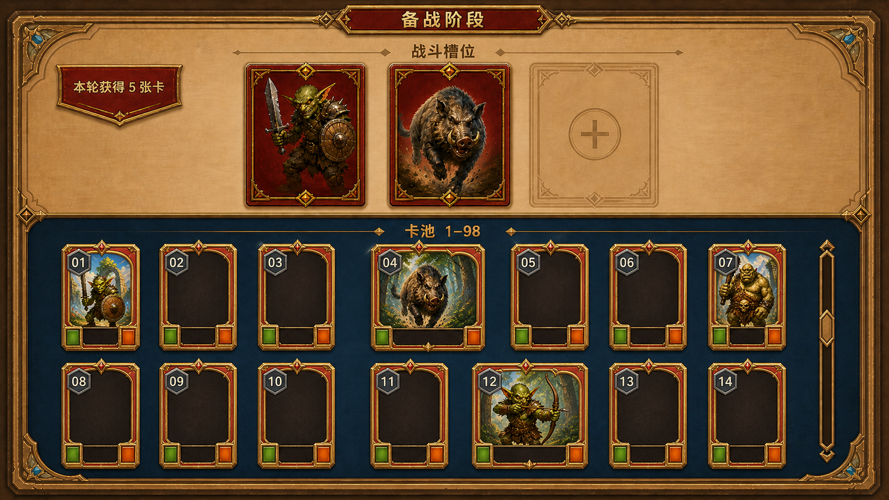

# 备战阶段页面原型方案 V2

> 本文档只用于确认备战页面的信息架构与视觉布局，不代表功能已经实现，也不是完整实施 Plan。V1 保留作布局密度对照。

## 1. 需求明确

### 1.1 本次修正

1. 卡池中的已拥有卡不再使用横向缩略条，统一展示完整 `2:3` 竖向卡面。
2. 16:9 页面改为每排 7 张卡，首屏展示两排 `01~14`。
3. 卡池仍按 `1~98` 稳定排序；玩家没有对应卡时，保留同尺寸完整竖向空槽。
4. 上方仍固定为 3 个战斗槽位，下方仍是可纵向滑动的大型卡池。
5. 每轮结束发放 5 张卡的页面反馈保持不变。

## 2. UI 部分

### 2.1 页面结构

页面继续采用上下分区。上方是 3 个战斗槽位，下方是完整卡面卡池。七列布局在保留完整卡面轮廓、编号和基础信息区域的同时，使首屏可以浏览 14 个连续编号。

| 区域 | V2 原型表现 | 表达的规则 |
| --- | --- | --- |
| 页面标题 | 顶部中央“备战阶段” | 当前处于战斗之外的独立阶段 |
| 发牌反馈 | 左上角“本轮获得 5 张卡” | 每轮结束固定发放 5 张卡 |
| 战斗槽位 | 上方横排 3 个大槽位；原型以 2 张卡和 1 个空槽示意 | 玩家当前编成固定包含 3 个位置 |
| 卡池标题 | “卡池 1–98” | 卡池覆盖完整编号范围 |
| 卡池网格 | 首屏 7 列×2 行，展示 `01~14` | 完整卡面下的浏览密度与编号连续性 |
| 已拥有位置 | 完整竖向卡面，保留立绘、名称、属性和灰色六边形编号 | 玩家持有对应编号 |
| 未拥有位置 | 同尺寸完整竖向空槽和编号 | 未持有时留空，不压缩、不重排 |
| 滚动反馈 | 面板右侧纵向滚动条 | 可继续向下浏览至编号 98 |

## 3. 美术部分

V2 沿用上一版的羊皮纸主面板、暖金边框、深蓝卡池、红金卡面及灰色六边形编号语言。卡池卡牌按完整竖卡设计，不把立绘和属性压缩成横向列表条目；空槽也保持相同轮廓，以确保每个编号的位置稳定可预期。

| 产物 | 类型 | 用途 | 路径 |
| --- | --- | --- | --- |
| V1 原型 | 16:9 PNG UI Mockup | 保留五列横向缩略条方案作为比较依据 | `AutoDoc/Temp/Plan/preparation-stage-ui-prototype.png` |
| V2 原型 | 16:9 PNG UI Mockup | 确认完整卡面、七列网格、稳定编号和空槽表现 | `AutoDoc/Temp/Plan/preparation-stage-ui-prototype-v2.png` |

## 4. GameStage 部分

本次只调整卡池视觉密度，不改变备战阶段的概念边界：后续由新的备战 `GameStageGroup` 承载页面、3 个战斗槽位、编号卡池和本轮发牌反馈。具体 Stage 组成、卡牌交互、重复卡处理、进入下一轮方式等仍待后续规则确认。

## 5. 原型结论

以完整卡面为前提时，每排 7 张比每排 5 张更适合当前 16:9 页面：横向空间利用更充分，首屏能展示两个完整编号行，同时仍可辨认立绘、编号和属性区。后续实施应以 V2 的七列网格为视觉基准。
