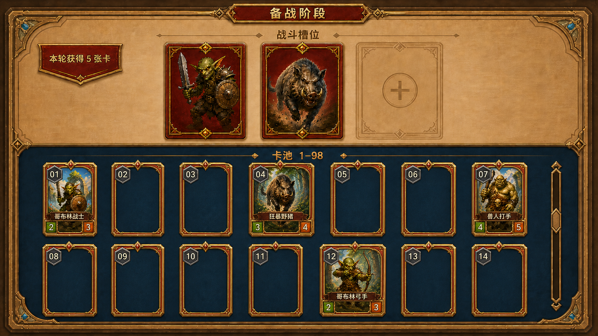

# 备战阶段页面原型方案 V3

> 本文档只用于确认备战页面的信息架构与视觉布局，不代表功能已经实现。V3 修正了 V2 卡位宽度不统一的问题。

## 1. 确定布局

1. 页面上方固定展示 3 个战斗槽位。
2. 页面下方为可纵向滑动的大型卡池，按编号 `1~98` 稳定排列。
3. 卡池每排 7 张完整 `2:3` 竖向卡面，首屏展示 `01~14` 两排。
4. 所有卡位共用同一固定宽高、同一列距和行距；已拥有卡与未拥有空槽的外轮廓完全等宽等高。
5. 玩家未拥有某编号时保留完整竖向空槽，不压缩、不补位。
6. 每轮结束发放 5 张卡的页面反馈保持不变。

## 2. V2 到 V3 的修正

| 项目 | V2 问题 | V3 结论 |
| --- | --- | --- |
| 卡位宽度 | 有卡位置与空槽宽度存在视觉漂移 | 14 个卡位统一固定宽度 |
| 卡位高度 | 装饰和内容使外轮廓不够稳定 | 两排使用统一固定高度 |
| 网格对齐 | 个别卡面左右边界不在同一栅格 | 七列严格共用列基线和间距 |
| 持有/缺失状态 | 两类槽位的组件感不一致 | 只改变内部内容，不改变外框尺寸 |

## 3. 原型边界

本次只修正视觉原型，不修改项目实现。后续新的备战 `GameStageGroup` 仍只承载 3 个战斗槽位、编号卡池和本轮发牌反馈；卡牌交互、重复卡处理和进入下一轮方式尚未在本原型中定义。

## 4. 产物

| 产物 | 路径 | 用途 |
| --- | --- | --- |
| V1 | `AutoDoc/Temp/Plan/preparation-stage-ui-prototype.png` | 五列横向条目对照 |
| V2 | `AutoDoc/Temp/Plan/preparation-stage-ui-prototype-v2.png` | 七列完整卡面的初稿对照 |
| V3 | `AutoDoc/Temp/Plan/preparation-stage-ui-prototype-v3.png` | 七列、完整卡面、统一宽高的当前确认稿 |
