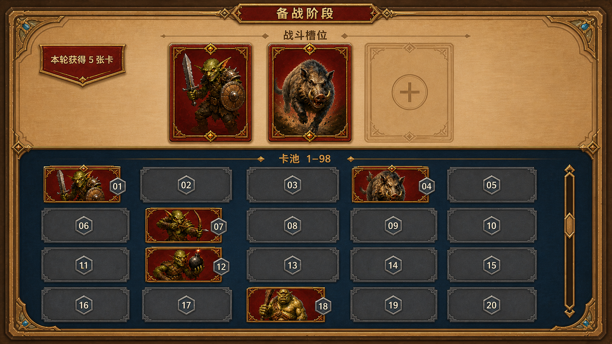

# 备战阶段页面原型方案

> 本文档只用于确认备战页面的信息架构与视觉布局，不代表功能已经实现，也不是完整实施 Plan。

## 1. 需求明确

### 1.1 需求对齐

1. 单轮战斗结束后进入独立的备战阶段；该阶段后续使用新的 GameStageGroup 承载。
2. 页面上方固定展示 3 个战斗槽位。
3. 页面下方是大型纵向滚动卡池，不使用传统手牌扇形布局。
4. 卡池固定每排 5 个位置，按编号 `1~98` 顺序排列。
5. 玩家未拥有某个编号时，该编号位置保持空槽，不压缩、不补位、不改变后续编号位置。
6. 每轮游戏结束后给玩家发 5 张卡，页面需要明确反馈本轮获得数量。
7. 本轮只确认原型；不定义选卡方式、重复卡处理、换卡、出售、锁定、费用、开始下一轮入口等规则。

## 2. UI部分

### 2.1 涉及到的UI部分概览

页面采用上下分区：顶部约三分之一为战斗编成区，底部约三分之二为卡池浏览区。卡池使用稳定编号槽位表达收藏状态，缺失卡不会改变网格中其他卡的位置。

### 2.2 原型布局

| 区域 | 原型表现 | 表达的规则 |
| --- | --- | --- |
| 页面标题 | 顶部中央“备战阶段” | 当前处于战斗之外的独立阶段 |
| 发牌反馈 | 左上角“本轮获得 5 张卡” | 每轮结束固定发放 5 张卡 |
| 战斗槽位 | 上方横排 3 个大槽位；原型用 2 张卡和 1 个空槽展示状态 | 玩家当前编成固定包含 3 个位置 |
| 卡池标题 | “卡池 1–98” | 卡池覆盖完整编号范围 |
| 卡池网格 | 首屏为 5 列×4 行，展示 `01~20` | 每排固定 5 个编号并按阅读顺序递增 |
| 已拥有位置 | 显示怪物卡面与灰色六边形编号牌 | 玩家持有对应编号 |
| 未拥有位置 | 保留同尺寸深灰空槽与编号牌 | 未持有时留空，不重排列表 |
| 滚动反馈 | 面板右侧纵向滚动条 | 卡池可继续向下浏览至编号 98 |

## 3. 美术部分

### 3.1 涉及到的美术表现概览

原型沿用当前 `UI-STYLE-001`：浅色羊皮纸主面板、暖金雕花边框、深蓝卡池内容区、红金已拥有卡牌、冷灰缺失槽位，以及现有灰色六边形编号牌语言。图中卡牌和场景风格参考当前战斗概念图，未新增正式游戏资源。

### 3.2 原型产物

| 产物 | 类型 | 用途 | 路径 |
| --- | --- | --- | --- |
| 备战阶段页面第一版原型 | 16:9 PNG UI Mockup | 确认页面信息架构、卡池网格和持有/缺失状态 | `AutoDoc/Temp/Plan/preparation-stage-ui-prototype.png` |

## 4. GameStage部分

### 4.1 新增GameStageGroup概念边界

| GameStageGroup | 原型阶段确认的职责 | 尚未在本轮确定的内容 |
| --- | --- | --- |
| 备战阶段 GameStageGroup | 在单轮战斗结束后承载备战页面、3 个编成槽位、编号卡池与本轮发牌反馈 | 具体 Stage 组成、状态持久化、下一轮入口和与 BattleStage 的切换实现 |

## 5. 实现顺序建议

1. 先由用户确认本原型的上下区域占比、卡池空槽表达和 3 个战斗槽位形态。
2. 原型确认后，再明确选卡/撤卡方式、重复卡处理、5 张卡的发放表现以及进入下一轮的触发方式。
3. 规则确认后再编写完整实施 Plan，按数据、UI 编辑场景与导出、GameStageGroup、发牌流程和验证顺序拆解 Todo。
